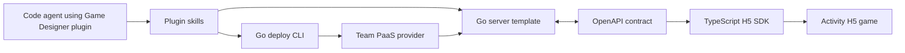

# feat: Build Game Designer Server Plugin MVP

## Summary

Implement a greenfield Game Designer server plugin MVP as one contract-first golden path: a Go backend template, Go deploy CLI, TypeScript H5 SDK, and agent-facing plugin skills that let a code agent connect and deploy an activity-style H5 game to the team's PaaS.

---

## Problem Frame

Product/operations H5 mini-game creators currently rely on temporary backend work or ad hoc changes to existing backends for each campaign. This plan turns that repeated custom work into an agent-executable backend integration and deployment workflow, preserving the brainstorm's core success condition: the code agent can connect and deploy the game backend without the human developer designing backend APIs.

---

## Requirements

- R1. Provide plugin skills that guide a code agent through create/attach backend, connect SDK, verify integration, prepare deploy, and deploy to PaaS.
- R2. Optimize for code-agent autonomy with discoverable steps, runnable checks, and interpretable success/failure output.
- R3. Expose one clear golden path for an activity-style H5 game rather than a broad backend feature menu.
- R4. Include login/session and player profile capability in the Go server template.
- R5. Include game-state save and resume capability in the Go server template.
- R6. Include score submission and leaderboard capability in the Go server template.
- R7. Make the capabilities work as one player loop: identify player, save/resume state, submit score, and read leaderboard.
- R8. Provide a TypeScript H5 SDK for login/session, player profile, game-state save, score submission, and leaderboard read.
- R9. Keep Go server behavior and TypeScript SDK usage aligned through an explicit contract-first workflow.
- R10. Provide SDK examples and agent-readable guidance so the code agent does not invent call patterns.
- R11. Provide a Go deploy CLI with a default provider for the team's own PaaS.
- R12. Make deploy a lifecycle: preflight checks, deploy execution, status/health verification, and final agent-readable result.
- R13. Keep a provider boundary for future deployment targets without implementing multiple providers in the MVP.
- R14. Include local/test verification that proves the SDK can call backend capabilities before deployment.
- R15. Include deployed verification that proves the activity-game loop works after release to PaaS.
- R16. Return structured failure output that lets the agent retry, fix integration, ask for missing configuration, or stop clearly.

**Origin actors:** A1 product/operations H5 mini-game creator, A2 code agent, A3 backend/platform maintainer, A4 game player, A5 team PaaS
**Origin flows:** F1 agent connects an H5 game to the backend, F2 agent deploys the connected backend to the team PaaS, F3 player completes the activity-game backend loop
**Origin acceptance examples:** AE1 backend connection, AE2 PaaS deploy, AE3 deployed game loop, AE4 contract-aligned SDK update

---

## Scope Boundaries

- In scope: server-side MVP for activity-style H5 mini-games.
- In scope: Go server template, Go deploy CLI, TypeScript H5 SDK, agent-facing plugin skills, and verification docs/scripts.
- In scope: one default PaaS provider for the team's own platform.
- In scope: provider interface boundaries for later targets.
- Deferred: rewards, redemption codes, entitlement issuance, payments, monetization, and anti-cheat beyond basic validation hooks.
- Deferred: public cloud providers such as Vercel, Cloudflare Workers, Tencent Cloud, Alibaba Cloud, or others.
- Deferred: visual H5 editor integration, game-play generation, marketplace, and multi-game template catalog.
- Out of scope: medium/heavy online game needs such as realtime multiplayer, matchmaking, or long-running economy systems.

### Deferred to Follow-Up Work

- Real PaaS API adapter hardening: the MVP should define the provider contract and implement the team's default provider, but production-specific retries, rollout controls, and environment policy should be refined after the real PaaS API details are confirmed.
- Template upgrade workflow: the plan should leave room for `upgrade-template`, but initial execution should focus on the create/connect/deploy golden path.

---

## Context & Research

### Relevant Code and Patterns

- The repository is currently greenfield: no application code, build files, or existing conventions are present.
- Existing planning artifacts:
  - `docs/ideation/2026-05-16-game-designer-server-plugin-ideation.md`
  - `docs/brainstorms/2026-05-16-game-designer-server-plugin-mvp-requirements.md`

### Institutional Learnings

- No `docs/solutions/` directory exists yet, so there are no local institutional patterns to reuse.

### External References

- Go modules/workspaces are the base package-management model for the Go server and Go CLI; Go workspaces support multiple local modules through `go.work`.
- OpenAPI Generator supports TypeScript client generation and lists Go server generators, but the plan should treat generator choice as implementation-time research because official generator maturity varies by target.
- TypeScript package types should be published with the SDK package so H5 projects get typed usage without a separate `@types` package.
- Cobra is a mature Go CLI framework and is a reasonable planning reference for the deploy CLI shape, while final dependency selection can be confirmed during implementation.

---

## Key Technical Decisions

- Contract-first boundary: Author the MVP API contract explicitly and generate or validate TypeScript SDK bindings from it, rather than hand-maintaining separate Go and TypeScript interfaces. This directly addresses R9 and AE4.
- Go for server and deploy CLI: Keep the runtime and deploy toolchain in Go, matching the user's technical direction and simplifying PaaS provider integration.
- TypeScript only for the H5 SDK: The SDK should feel natural inside browser/H5 game projects and ship first-class type declarations.
- Monorepo with clear package boundaries: Use one repo so the contract, server template, CLI, SDK, skills, examples, and verification assets can evolve together during MVP development.
- Golden-path verification over broad capability demos: Prove the whole activity loop before expanding the backend capability menu.
- Provider interface plus one default provider: Define a provider boundary, but only implement the team's PaaS provider in the MVP.

---

## Open Questions

### Resolved During Planning

- CLI language: Use Go for the deploy CLI, per user correction.
- Overall delivery shape: Build one full golden path rather than isolated template, SDK, and deploy deliverables.
- Primary contract posture: Plan around OpenAPI/contract-first alignment between Go server and TypeScript SDK.

### Deferred to Implementation

- Exact OpenAPI tooling: Choose the specific Go/OpenAPI and TypeScript generation tools after evaluating fit during implementation.
- PaaS deploy API details: Confirm auth, upload/release, status, health, log, and rollback primitives against the team's actual PaaS.
- Persistence backend details: Decide whether MVP local/dev persistence uses embedded storage, a simple external database profile, or an abstraction with a default only after implementation constraints are known.
- Skill packaging format: Finalize exact Game Designer plugin manifest/skill packaging based on the local plugin runtime conventions available during implementation.

---

## Output Structure

    contracts/
      game-server.openapi.yaml
    server-template/
      cmd/server/
      internal/
      test/
      README.md
    sdk-js/
      src/
      examples/
      package.json
      tsconfig.json
    cli/
      cmd/game-designer/
      internal/
      test/
      README.md
    plugin/
      skills/
        create-game-server/
        connect-js-sdk/
        prepare-deploy/
        deploy-game-server/
        debug-server-integration/
    examples/
      h5-activity-game/
    docs/
      brainstorms/
      ideation/
      plans/
      integration/
      deployment/
    scripts/
      verify-local.sh
      verify-deployed.sh

---

## High-Level Technical Design

> *This illustrates the intended approach and is directional guidance for review, not implementation specification. The implementing agent should treat it as context, not code to reproduce.*

The intended golden path is:

1. Agent uses plugin skills to create or attach the Go server template.
2. Server capabilities are defined through the shared API contract.
3. TypeScript SDK is generated or validated from the contract.
4. Agent connects the SDK to the H5 game.
5. Agent runs local verification for login/profile, state save, score submit, and leaderboard read.
6. Agent uses the Go CLI to run PaaS preflight, deploy, status/health verification, and result reporting.

---

## Implementation Units

### U1. Establish Greenfield Workspace and Contracts

**Goal:** Create the repo structure, workspace metadata, and initial contract-first API surface for the MVP activity-game backend.

**Requirements:** R3, R4, R5, R6, R7, R9

**Dependencies:** None

**Files:**
- Create: `go.work`
- Create: `contracts/game-server.openapi.yaml`
- Create: `contracts/README.md`
- Create: `docs/integration/contract-first-workflow.md`
- Test: `contracts/test/game-server-contract.test.ts` or equivalent contract validation test path chosen during implementation

**Approach:**
- Define the MVP contract around the activity-game loop: session/profile, game-state save/read, score submit, and leaderboard read.
- Keep the contract small and explicit enough for Go server implementation, TS SDK generation, and agent-readable examples.
- Add contract validation so changes fail fast when the schema is malformed or drifts from documented expectations.

**Patterns to follow:**
- Use the brainstorm requirements as the product source of truth.
- Use official OpenAPI structure and keep generated outputs out of hand-authored contract files.

**Test scenarios:**
- Happy path: contract validation accepts the initial MVP OpenAPI document.
- Error path: contract validation rejects a missing required operation or invalid schema reference.
- Integration: a sample generator or validator can read the contract without manual patching.

**Verification:**
- The contract can be validated independently and names every MVP capability required by the origin document.

---

### U2. Build Go Server Template Capabilities

**Goal:** Implement the Go backend template with the MVP server capabilities behind the contract-defined surface.

**Requirements:** R4, R5, R6, R7, R14, AE1, AE3

**Dependencies:** U1

**Files:**
- Create: `server-template/go.mod`
- Create: `server-template/cmd/server/main.go`
- Create: `server-template/internal/session/`
- Create: `server-template/internal/profile/`
- Create: `server-template/internal/gamestate/`
- Create: `server-template/internal/leaderboard/`
- Create: `server-template/internal/http/`
- Create: `server-template/internal/store/`
- Create: `server-template/test/`
- Create: `server-template/README.md`
- Test: `server-template/internal/session/session_test.go`
- Test: `server-template/internal/profile/profile_test.go`
- Test: `server-template/internal/gamestate/gamestate_test.go`
- Test: `server-template/internal/leaderboard/leaderboard_test.go`
- Test: `server-template/internal/http/http_integration_test.go`

**Approach:**
- Keep the template capability-led, not framework-led: session/profile, state, and leaderboard are the visible domains.
- Provide a default local/dev persistence mode and isolate persistence behind a narrow store boundary so PaaS-specific storage can be swapped later.
- Make HTTP handlers conform to the shared contract and return agent-diagnosable errors for invalid input and missing state.
- Avoid reward, entitlement, payment, and realtime gameplay surfaces in the MVP template.

**Execution note:** Implement new domain behavior test-first where practical, especially leaderboard ordering and state resume behavior.

**Patterns to follow:**
- Go standard project layout conventions.
- Contract-first handler behavior from U1.

**Test scenarios:**
- Covers AE1. Happy path: a new player session can be created or resumed and profile data can be read.
- Covers AE3. Happy path: a player saves state, submits a score, and appears in the leaderboard.
- Edge case: submitting multiple scores for the same player applies the intended ranking/update rule.
- Edge case: reading state for an unknown or expired player returns a clear recoverable response.
- Error path: malformed session, state, or score requests return structured validation failures.
- Integration: HTTP-level test exercises the complete activity loop through the public API surface.

**Verification:**
- The Go server template runs locally and passes domain plus HTTP integration tests for the full MVP loop.

---

### U3. Generate and Package the TypeScript H5 SDK

**Goal:** Provide a typed TypeScript SDK for H5 game integration, aligned with the shared API contract.

**Requirements:** R8, R9, R10, R14, AE1, AE4

**Dependencies:** U1, U2

**Files:**
- Create: `sdk-js/package.json`
- Create: `sdk-js/tsconfig.json`
- Create: `sdk-js/src/`
- Create: `sdk-js/examples/basic-activity-game.ts`
- Create: `sdk-js/README.md`
- Create: `scripts/generate-sdk.sh`
- Test: `sdk-js/src/**/*.test.ts`
- Test: `sdk-js/examples/basic-activity-game.test.ts`

**Approach:**
- Generate or validate low-level client types from the OpenAPI contract.
- Add a small hand-authored ergonomic wrapper for the game-facing operations if generator output is too mechanical for H5 usage.
- Publish type declarations with the SDK package.
- Include concise examples that the code agent can copy into an H5 game without inventing call order.

**Patterns to follow:**
- TypeScript package declaration publishing guidance.
- Generated client plus thin ergonomic wrapper pattern.

**Test scenarios:**
- Covers AE4. Happy path: SDK type generation or validation succeeds from the current contract.
- Happy path: example code logs in, saves state, submits score, and reads leaderboard against a mock or local server.
- Error path: SDK surfaces structured server validation errors without losing actionable detail.
- Integration: generated client types match the server contract expected by U2 HTTP integration tests.

**Verification:**
- SDK builds with type declarations and its example integration can run against the local Go server or a mocked contract-compatible server.

---

### U4. Build Go Deploy CLI and PaaS Provider Boundary

**Goal:** Implement the Go CLI for preflight, deploy, status/health verification, and structured result reporting against the team's PaaS provider.

**Requirements:** R11, R12, R13, R15, R16, AE2

**Dependencies:** U1, U2

**Files:**
- Create: `cli/go.mod`
- Create: `cli/cmd/game-designer/main.go`
- Create: `cli/internal/commands/`
- Create: `cli/internal/provider/`
- Create: `cli/internal/provider/paas/`
- Create: `cli/internal/preflight/`
- Create: `cli/internal/reporting/`
- Create: `cli/README.md`
- Test: `cli/internal/provider/provider_test.go`
- Test: `cli/internal/preflight/preflight_test.go`
- Test: `cli/internal/reporting/reporting_test.go`
- Test: `cli/internal/commands/deploy_integration_test.go`

**Approach:**
- Model deploy as a lifecycle: validate config, package/build server template, call provider deploy, poll status/health, and emit a final result.
- Keep the provider interface small and centered on the MVP PaaS operations needed for deployment and verification.
- Emit structured output that code agents can parse or summarize, while still being readable by humans.
- Use a fake provider in tests so deploy behavior can be verified without touching the real PaaS.

**Execution note:** Start with command and provider contract tests before binding to the real PaaS client.

**Patterns to follow:**
- Go CLI conventions, with Cobra as a reasonable reference candidate during implementation.
- Provider-interface pattern from the origin requirement to support future providers without implementing them now.

**Test scenarios:**
- Covers AE2. Happy path: valid config runs preflight, deploys through a fake provider, verifies health, and returns success.
- Error path: missing PaaS config stops at preflight with a structured missing-configuration result.
- Error path: provider deploy failure returns a structured failure with retry/stop semantics.
- Error path: health verification timeout returns an actionable failure rather than a generic crash.
- Integration: deploy command can target a locally running server template or fixture artifact with the fake provider.

**Verification:**
- The CLI can run the full deploy lifecycle against a fake provider and produce agent-readable success and failure results.

---

### U5. Create Agent Plugin Skills for the Golden Path

**Goal:** Package the MVP workflow as agent-facing skills that guide creation, SDK connection, deploy preparation, deployment, and debugging.

**Requirements:** R1, R2, R3, R10, R16, AE1, AE2

**Dependencies:** U1, U2, U3, U4

**Files:**
- Create: `plugin/skills/create-game-server/SKILL.md`
- Create: `plugin/skills/connect-js-sdk/SKILL.md`
- Create: `plugin/skills/prepare-deploy/SKILL.md`
- Create: `plugin/skills/deploy-game-server/SKILL.md`
- Create: `plugin/skills/debug-server-integration/SKILL.md`
- Create: `plugin/README.md`
- Test: `plugin/skills/**/skill-fixtures.md`
- Test: `plugin/skills/**/skill-review.test.md` or equivalent harness path chosen during implementation

**Approach:**
- Keep the MVP skill set focused on the golden path; do not include `upgrade-template` as an active MVP skill yet.
- Each skill should define when it applies, what files/surfaces it may change, what checks it should run, and what output indicates success or failure.
- Skills should direct the code agent to use the contract, SDK examples, local verification, and Go CLI rather than inventing integration steps.

**Patterns to follow:**
- Existing Codex/agent skill structure conventions available in the local plugin environment.
- The skill split proposed in the ideation document, narrowed to MVP.

**Test scenarios:**
- Happy path: `create-game-server` directs the agent to scaffold or attach the Go server template and verify it locally.
- Happy path: `connect-js-sdk` directs the agent to use SDK examples and contract alignment rather than hand-writing client calls.
- Happy path: `prepare-deploy` and `deploy-game-server` direct the agent through CLI preflight, deploy, and status checks.
- Error path: `debug-server-integration` gives the agent a triage path for SDK/server/contract/deploy failures.
- Integration: a human reviewer can follow the skill fixtures and see the complete agent golden path without missing a required step.

**Verification:**
- The plugin skills form a coherent sequence and each skill points to concrete verification outcomes.

---

### U6. Build Example H5 Activity Game Integration

**Goal:** Provide a minimal example H5 activity game that demonstrates the SDK and backend loop end to end.

**Requirements:** R3, R7, R8, R10, R14, R15, AE1, AE3, AE4

**Dependencies:** U2, U3

**Files:**
- Create: `examples/h5-activity-game/package.json`
- Create: `examples/h5-activity-game/src/`
- Create: `examples/h5-activity-game/README.md`
- Test: `examples/h5-activity-game/src/**/*.test.ts`
- Test: `examples/h5-activity-game/e2e/activity-loop.test.ts`

**Approach:**
- Keep the example intentionally small: one playable loop that logs in, saves progress, submits a score, and shows leaderboard state.
- Use the SDK as a real consumer, not internal server helpers.
- Make the example agent-friendly, with clear markers for where a generated or existing H5 game should call SDK operations.

**Patterns to follow:**
- Browser-oriented TypeScript example conventions.
- SDK example patterns from U3.

**Test scenarios:**
- Covers AE3. Happy path: player starts the example, state is saved, score is submitted, and leaderboard is displayed.
- Edge case: repeated play updates score behavior according to the server's ranking rule.
- Error path: backend unavailable or validation failure is surfaced in an example-friendly way.
- Integration: example runs against the local Go server through the SDK rather than mocks only.

**Verification:**
- The example proves the full local activity-game loop from H5 SDK calls through the Go backend.

---

### U7. Add Local and Deployed Verification Workflows

**Goal:** Provide repeatable checks that prove the golden path locally and after PaaS deployment.

**Requirements:** R14, R15, R16, AE2, AE3, AE4

**Dependencies:** U2, U3, U4, U6

**Files:**
- Create: `scripts/verify-local.sh`
- Create: `scripts/verify-deployed.sh`
- Create: `docs/integration/local-verification.md`
- Create: `docs/deployment/deployed-verification.md`
- Test: `scripts/test/verify-local.test.sh`
- Test: `scripts/test/verify-deployed.test.sh`

**Approach:**
- Local verification should start or target the Go server, run SDK-backed activity-loop checks, and report actionable failures.
- Deployed verification should target a deployed backend URL or deployment identifier, execute health plus activity-loop checks, and produce an agent-readable result.
- Keep verification outcome-oriented; exact shell command orchestration can evolve during implementation.

**Patterns to follow:**
- Existing CLI structured-result conventions from U4.
- Contract and SDK integration checks from U1 and U3.

**Test scenarios:**
- Happy path: local verification passes against a local server and example game fixture.
- Covers AE2. Happy path: deployed verification passes against a fake or test deployment endpoint.
- Error path: missing server URL, unreachable backend, or contract mismatch yields structured failure.
- Integration: verification catches an SDK/server mismatch before deploy when the contract changes.

**Verification:**
- The agent can run one local verification path before deploy and one deployed verification path after deploy.

---

### U8. Document Agent and Maintainer Workflows

**Goal:** Write concise docs for code agents, game creators, and maintainers covering the MVP golden path and maintenance responsibilities.

**Requirements:** R1, R2, R10, R16

**Dependencies:** U1, U2, U3, U4, U5, U6, U7

**Files:**
- Create: `README.md`
- Create: `docs/integration/agent-golden-path.md`
- Create: `docs/integration/sdk-usage.md`
- Create: `docs/deployment/paas-provider.md`
- Create: `docs/deployment/troubleshooting.md`
- Test: `docs/test/docs-link-check.test.ts` or equivalent docs verification path chosen during implementation

**Approach:**
- Keep docs short and workflow-shaped; long prose should not be required for agent success.
- Separate human orientation from agent-executable instructions.
- Explain the contract-first workflow, SDK regeneration/validation, CLI deploy lifecycle, and common failure categories.

**Patterns to follow:**
- Requirements and plan documents already in `docs/`.
- Agent-readable instruction style from U5.

**Test scenarios:**
- Happy path: docs link to the contract, server template, SDK, CLI, skills, example game, and verification workflows.
- Error path: troubleshooting docs cover SDK/server mismatch, missing PaaS config, deploy failure, and health verification failure.
- Test expectation: docs link/anchor validation is sufficient; no product behavior is implemented in this unit.

**Verification:**
- A downstream implementer or agent can understand the MVP workflow and maintenance boundaries without reading the plan.

---

## System-Wide Impact

- **Interaction graph:** Contract changes affect the Go server, TypeScript SDK, example game, plugin skill instructions, and verification workflows.
- **Error propagation:** Server validation errors, SDK errors, CLI preflight errors, provider errors, and deployed health failures must stay structured enough for agent triage.
- **State lifecycle risks:** Player session/profile, saved state, and leaderboard updates can drift if persistence and ranking rules are not consistently tested.
- **API surface parity:** Public API contract, Go handler behavior, TypeScript SDK methods, example usage, and verification scenarios must remain aligned.
- **Integration coverage:** Unit tests alone will not prove the MVP; the plan requires local and deployed activity-loop verification.
- **Unchanged invariants:** The MVP does not introduce rewards, payments, realtime multiplayer, or public-cloud deployments.

---

## Risks & Dependencies

| Risk | Mitigation |
|------|------------|
| Cross-language drift between Go server and TypeScript SDK | Use contract-first generation/validation and make drift visible in CI/verification. |
| PaaS API details are under-specified | Keep provider boundary narrow and defer exact adapter behavior until implementation confirms available PaaS operations. |
| Golden path becomes a broad backend platform | Keep active units tied to the activity-game loop and defer rewards, payments, realtime, and marketplace work. |
| Agent skills become prose docs rather than executable guidance | Each skill must name applicability, editable surfaces, checks, and success/failure outcomes. |
| Deploy failures are opaque to code agents | CLI and verification output must be structured and categorized. |
| Example game hides integration problems behind mocks | Example and verification must run through the real SDK and local/deployed backend paths. |

---

## Documentation / Operational Notes

- Document the contract-first workflow before adding additional backend capabilities.
- Treat the team's PaaS provider as the only production deploy target for MVP.
- Keep generated SDK artifacts clearly separated from hand-authored ergonomic wrappers.
- Add troubleshooting docs for four first-class failure classes: contract mismatch, SDK integration failure, missing PaaS configuration, and failed deployed health check.

---

## Success Metrics

- A code agent can complete the local backend connection flow for the example activity game.
- A code agent can deploy the connected backend to the team PaaS through the Go CLI.
- Local verification proves login/profile, state save, score submit, and leaderboard read.
- Deployed verification proves the same loop against a released service.
- SDK/server contract mismatch is caught before deployment.

---

## Sources & References

- **Origin document:** [docs/brainstorms/2026-05-16-game-designer-server-plugin-mvp-requirements.md](../brainstorms/2026-05-16-game-designer-server-plugin-mvp-requirements.md)
- **Ideation document:** [docs/ideation/2026-05-16-game-designer-server-plugin-ideation.md](../ideation/2026-05-16-game-designer-server-plugin-ideation.md)
- **Go modules reference:** [go.dev/ref/mod](https://go.dev/ref/mod)
- **OpenAPI Generator TypeScript generator docs:** [openapi-generator.tech/docs/generators/typescript](https://openapi-generator.tech/docs/generators/typescript/)
- **OpenAPI Generator generators list:** [openapi-generator.tech/docs/generators](https://openapi-generator.tech/docs/generators/)
- **TypeScript declaration publishing docs:** [typescriptlang.org/docs/handbook/declaration-files/publishing.html](https://www.typescriptlang.org/docs/handbook/declaration-files/publishing.html)
- **Cobra documentation:** [cobra.dev/docs](https://cobra.dev/docs/)
