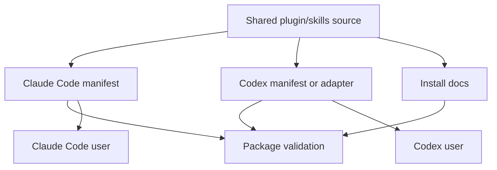
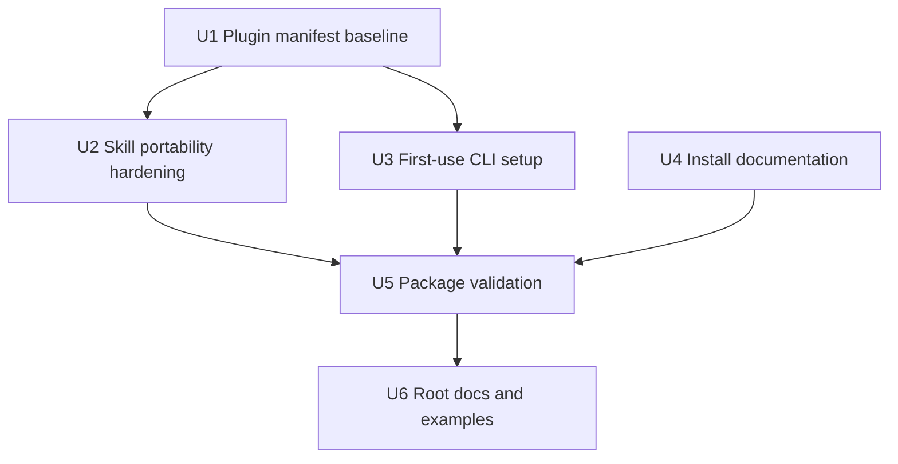

# feat: Package Game Designer for Claude Code and Codex Agents

## Summary

Add an installable code-agent plugin distribution layer on top of the completed Game Designer MVP so Claude Code and Codex can discover, install, and use the existing skills and bundled project assets quickly. The work keeps the current backend, SDK, CLI, and skill golden path intact while adding platform manifests, installation guidance, first-use CLI build handling, and validation checks for plugin consumers.

---

## Problem Frame

The MVP already proves the contract-first server template, SDK, CLI, and skill workflow. What is still thin is the distribution surface: a code agent can read `plugin/skills/`, but users do not yet have a clear Claude Code or Codex installation path, and the repository does not advertise itself through platform-specific plugin metadata.

---

## Requirements

- R1. Provide an installable plugin package shape for Claude Code that includes the existing Game Designer skills.
- R2. Provide a Codex-compatible package shape or adapter path that lets Codex users install or import the same skill set with minimal manual work.
- R3. Preserve one shared skill source of truth where possible so Claude Code and Codex instructions do not drift.
- R4. Document a quick installation path for both Claude Code and Codex users, including local development installation and marketplace or shared-repo installation when supported.
- R5. Make the plugin self-describing for code agents: metadata, skill list, golden-path order, prerequisites, verification commands, and expected success/failure outputs must be easy to discover.
- R6. Add validation or smoke checks that catch missing manifests, broken skill frontmatter, missing referenced paths, and stale installation instructions.
- R7. Keep the plugin scoped to the MVP activity-game backend workflow rather than adding new backend capabilities.
- R8. Do not assume plugin installation compiles the Go CLI; provide an explicit first-use setup or preflight path that builds, caches, and verifies the CLI binary when needed.

**Origin actors:** A1 product/operations H5 mini-game creator, A2 code agent, A3 backend/platform maintainer
**Origin flows:** F1 agent connects an H5 game to the backend, F2 agent deploys the connected backend to the team PaaS
**Origin acceptance examples:** AE1 backend connection, AE2 PaaS deploy, AE4 contract-aligned SDK update

---

## Scope Boundaries

- In scope: plugin packaging, manifests, install documentation, agent-facing README updates, and validation checks.
- In scope: Claude Code and Codex only.
- In scope: local install from this repository and shared-repo or marketplace-style install guidance where the target agent supports it.
- In scope: improving existing skill docs so agents can execute them reliably after installation.
- Out of scope: publishing to a public plugin marketplace during this change.
- Out of scope: adding new backend, SDK, CLI, or PaaS provider capabilities beyond packaging needs.
- Out of scope: shipping prebuilt multi-platform CLI binaries in the plugin package.
- Out of scope: supporting Cursor, Copilot, Gemini, Cline, or other agent runtimes in this iteration.

### Deferred to Follow-Up Work

- Public marketplace publication and review: prepare after the internal package shape is validated.
- Versioned release automation: useful after the first installable package is stable.
- Multi-agent compatibility beyond Claude Code and Codex: keep for a later compatibility matrix.

---

## Context & Research

### Relevant Code and Patterns

- `plugin/skills/*/SKILL.md` already contains the five MVP skills: create server, connect SDK, prepare deploy, deploy server, and debug integration.
- `plugin/README.md` already names the skill sequence but does not describe install commands, manifest files, or host-specific discovery.
- `docs/integration/agent-golden-path.md` describes the workflow once skills are available, but not how a user installs the plugin into Claude Code or Codex.
- `.claude/settings.json` exists for local Claude settings, but the repo does not yet contain a root-level `.claude-plugin/` manifest directory.
- There is no root-level `.codex-plugin/` manifest or Codex-specific install guide in the repo today.

### Institutional Learnings

- No `docs/solutions/` directory exists, so there are no local institutional learnings to apply.

### External References

- Claude Code plugin documentation describes a plugin as a directory with `.claude-plugin/plugin.json`, while standard plugin content such as `skills/`, `commands/`, `agents/`, and `hooks/` lives at the plugin root.
- Claude Code marketplace documentation describes `.claude-plugin/marketplace.json` for repository-hosted plugin discovery and `/plugin marketplace add` plus `/plugin install` as the user-facing install route.
- Plugin installation should be treated as package copy and discovery, not as a build lifecycle; the Go CLI needs an explicit setup or first-use build path.
- OpenAI Codex public guidance describes plugins and skills as installable capabilities surfaced through the Codex Plugins UI, with skills invoked from the thread using `$skill-name`. Public details for a repository-local `.codex-plugin/plugin.json` package shape should be verified during implementation against the current Codex plugin creator or official docs.

---

## Key Technical Decisions

- Use the repository root as the installable plugin root: Claude Code copies only the plugin directory into its cache, so sibling assets outside the selected root are not available after install. A root plugin package keeps `server-template/`, `cli/`, `sdk-js/`, `contracts/`, examples, and scripts available to installed skills.
- Prefer one shared skill source: Claude Code and Codex should both consume `plugin/skills/` unless Codex implementation-time validation proves a thin adapter is required.
- Add host-specific manifests, not host-specific skill forks: Platform differences belong in metadata and installation docs, while task behavior stays in each `plugin/skills/*/SKILL.md`.
- Treat Codex manifest fields as verification-sensitive: implementers should confirm the current Codex plugin schema before finalizing `.codex-plugin/plugin.json`, because Codex plugin packaging guidance is less explicit in the public docs than Claude Code's.
- Build the Go deploy CLI on first use rather than at plugin install time: `prepare-deploy` or a dedicated setup skill should compile the binary into a plugin-local or user-cache location and verify it before deployment.
- Keep installation docs short and agent-actionable: first path should be local install from this repo, followed by shared-repo or marketplace guidance.

---

## Open Questions

### Resolved During Planning

- Plan file handling: create a new plan rather than modifying the completed MVP plan.
- Target runtimes: only Claude Code and Codex are in scope.
- Product scope: improve plugin packaging and installation guidance without adding backend capabilities.

### Deferred to Implementation

- Exact Codex manifest schema: verify against the installed Codex plugin creator, official Codex docs, or local plugin examples before committing the final manifest keys.
- Marketplace naming: choose the final marketplace alias when the repository owner or distribution channel is known.
- Public install command variants: confirm whether the team wants local-only installation, GitHub repository installation, or both in the first documented release.
- CLI binary cache path: choose a cross-platform location during implementation after checking host expectations, preferring a plugin-local ignored directory for local development and a user-cache path if installed plugin directories are read-only.

---

## Output Structure

    .claude-plugin/
      plugin.json
      marketplace.json
    .codex-plugin/
      plugin.json
    plugin/
      skills/
        setup-game-designer-cli/
        create-game-server/
        connect-js-sdk/
        prepare-deploy/
        deploy-game-server/
        debug-server-integration/
      README.md
      INSTALL.md
    docs/
      integration/
        agent-golden-path.md
        plugin-installation.md
    server-template/
    cli/
    sdk-js/
    contracts/
    examples/
    scripts/
      verify-plugin-package.sh

---

## High-Level Technical Design

> *This illustrates the intended approach and is directional guidance for review, not implementation specification. The implementing agent should treat it as context, not code to reproduce.*

The intended package model is the repository root as one asset-bearing plugin root with host-specific metadata. The validation layer should confirm that both hosts can discover the same skills under `plugin/skills/`, that bundled assets such as the server template and CLI are reachable from the installed plugin copy, and that the docs tell users how to install and verify the package without reading the whole repository.

---

## Implementation Units

### U1. Add Host Plugin Manifests

**Goal:** Make the repository root self-describing as an installable plugin package for Claude Code and Codex while keeping skill files under `plugin/skills/`.

**Requirements:** R1, R2, R3, R5

**Dependencies:** None

**Files:**
- Create: `.claude-plugin/plugin.json`
- Create: `.claude-plugin/marketplace.json`
- Create: `.codex-plugin/plugin.json`
- Modify: `plugin/README.md`
- Test: `scripts/verify-plugin-package.sh`

**Approach:**
- Add a Claude Code manifest that names the plugin, version, description, and custom skill path using the current Claude Code plugin schema.
- Add a repository-local Claude marketplace file suitable for local or shared-repo discovery, with placeholder-safe owner or source values that documentation can explain.
- Add a Codex manifest or adapter metadata file after verifying the current Codex package schema during implementation.
- Ensure manifest component paths are relative to the repository-root plugin package and point to `./plugin/skills/`, not `./skills/`.
- Keep all manifest descriptions aligned with the MVP golden path and avoid promising unsupported capabilities.

**Execution note:** Validate the current Codex manifest schema before finalizing `.codex-plugin/plugin.json`.

**Patterns to follow:**
- Follow Claude Code's documented root `.claude-plugin/plugin.json` and `.claude-plugin/marketplace.json` structure.
- Follow the existing `plugin/skills/` directory as the shared skill source.

**Test scenarios:**
- Happy path: validation detects both `.claude-plugin/plugin.json` and `.codex-plugin/plugin.json` at the repository root and confirms they reference the same plugin name and skill set.
- Edge case: validation fails when a manifest references a skill directory that does not exist.
- Error path: validation fails when required manifest fields such as name, description, version, or skills are missing.
- Integration: a fresh checkout can identify the repository root as the plugin root, enumerate the five MVP skills from metadata, and find bundled assets such as `server-template/` and `cli/`.

**Verification:**
- Both host manifests exist at the repository root, are valid JSON, and describe the same Game Designer plugin scope.

---

### U2. Harden Skills for Cross-Agent Execution

**Goal:** Ensure the existing skills are portable, explicit, and reliable when invoked by Claude Code or Codex after installation.

**Requirements:** R3, R5, R7

**Dependencies:** U1

**Files:**
- Modify: `plugin/skills/create-game-server/SKILL.md`
- Modify: `plugin/skills/connect-js-sdk/SKILL.md`
- Modify: `plugin/skills/prepare-deploy/SKILL.md`
- Modify: `plugin/skills/deploy-game-server/SKILL.md`
- Modify: `plugin/skills/debug-server-integration/SKILL.md`
- Test: `scripts/verify-plugin-package.sh`

**Approach:**
- Normalize skill frontmatter to the shared Agent Skills style: stable `name`, concise `description`, and clear trigger wording.
- Replace ambiguous local assumptions with agent-executable checks: where the agent should locate repo assets, which prerequisites must exist, and which verification output indicates success.
- Make each skill explain its safe write scope and read scope so an agent can avoid modifying unrelated game code.
- Keep commands as guidance and expected checks, while preserving the ability for the agent to adapt paths in the target project.

**Patterns to follow:**
- Preserve the current five-skill golden path.
- Follow the structured success and failure output already present in the skill docs.

**Test scenarios:**
- Happy path: each skill frontmatter parses and includes name and description.
- Edge case: validation catches duplicate skill names or a missing `SKILL.md`.
- Error path: validation catches stale references to files that no longer exist in the repository.
- Integration: the install docs can list the same skills discovered by the validation script.

**Verification:**
- Claude Code and Codex can present the skills with clear names and descriptions, and each skill remains scoped to the MVP backend workflow.

---

### U3. Add First-Use CLI Build Setup

**Goal:** Give agents an explicit, repeatable way to build and verify the Go deploy CLI after plugin installation and before deployment.

**Requirements:** R5, R6, R8

**Dependencies:** U1

**Files:**
- Create: `plugin/skills/setup-game-designer-cli/SKILL.md`
- Modify: `plugin/skills/prepare-deploy/SKILL.md`
- Modify: `plugin/skills/deploy-game-server/SKILL.md`
- Modify: `cli/README.md`
- Test: `scripts/verify-plugin-package.sh`

**Approach:**
- Add a setup skill or setup subsection that checks for Go, builds the CLI from `cli/cmd/game-designer`, stores the binary in a documented cache or build output path, and runs `version` or `preflight` to prove it works.
- Make `prepare-deploy` depend on this setup path so deployment skills never assume the binary exists simply because the plugin was installed.
- Document the difference between plugin installation, CLI build, local backend verification, and PaaS deployment.
- Keep prebuilt binary distribution out of this iteration.

**Patterns to follow:**
- Follow the current `cli/README.md` build command as the source of truth.
- Follow existing skill success/failure output blocks so agents can report build status clearly.

**Test scenarios:**
- Happy path: setup builds the CLI from source and verifies the resulting binary can report its version or run preflight.
- Edge case: setup reuses an existing compatible binary instead of rebuilding unnecessarily.
- Error path: setup fails clearly when Go is missing or the CLI build fails.
- Integration: `prepare-deploy` invokes or instructs the setup path before running deploy preflight.

**Verification:**
- A freshly installed plugin with no prebuilt CLI can reach a verified deploy CLI through the documented setup path.

---

### U4. Write Claude Code and Codex Installation Guides

**Goal:** Give users a fast, reliable path to install the plugin in Claude Code and Codex and confirm that it is available.

**Requirements:** R1, R2, R4, R5, R8

**Dependencies:** U1, U3

**Files:**
- Create: `plugin/INSTALL.md`
- Create: `docs/integration/plugin-installation.md`
- Modify: `plugin/README.md`
- Modify: `docs/integration/agent-golden-path.md`
- Test: `scripts/verify-plugin-package.sh`

**Approach:**
- Document local development installation first: clone or use this repo as the plugin root, add the plugin or marketplace, install the Game Designer plugin, and invoke the first skill.
- Document Claude Code's marketplace-style flow separately from Codex's Plugins UI or local import flow so users do not mix commands.
- Include a short verification section: list installed skills, invoke the CLI setup path, invoke the create-server skill, and run the existing local verification path.
- Add troubleshooting for common install failures: installing `plugin/` instead of the repository root, missing manifest, stale cached plugin, unavailable Codex schema, missing Go or Node prerequisites, and CLI build failures.

**Patterns to follow:**
- Reuse the existing `docs/integration/agent-golden-path.md` sequence once installation is complete.
- Keep docs agent-readable: short commands, expected success output, and recovery steps.

**Test scenarios:**
- Happy path: a user can follow the Claude Code local install section and see the five Game Designer skills.
- Happy path: a Codex user can follow the Codex section and invoke the skill set or import the local plugin package through the current Codex-supported path.
- Happy path: docs make clear that CLI compilation happens during setup or first deploy preparation, not during plugin installation.
- Edge case: docs explain what to do when the plugin is installed but skills are not visible or bundled assets are missing.
- Error path: docs explain how to recover from missing prerequisites or invalid manifest errors.

**Verification:**
- Installation docs include both Claude Code and Codex, a quick-start path, and a post-install smoke check.

---

### U5. Add Plugin Package Validation

**Goal:** Add a repeatable check that protects the plugin package from manifest drift and broken installation docs.

**Requirements:** R3, R5, R6, R8

**Dependencies:** U2, U3, U4

**Files:**
- Create: `scripts/verify-plugin-package.sh`
- Modify: `README.md`
- Modify: `plugin/README.md`
- Test: `scripts/verify-plugin-package.sh`

**Approach:**
- Validate manifest JSON syntax and required fields.
- Enumerate `plugin/skills/*/SKILL.md` and compare discovered skill names with manifest entries.
- Verify that the chosen plugin root contains required bundled assets: `server-template/`, `cli/`, `sdk-js/`, `contracts/`, `examples/`, and `scripts/`.
- Verify that CLI setup documentation and skill metadata exist, without requiring the validation script itself to compile the CLI.
- Check that documentation references the expected install docs and skill names.
- Keep the script lightweight and dependency-minimal so agents can run it before broader verification.

**Patterns to follow:**
- Follow the existing `scripts/verify-local.sh` and `scripts/verify-deployed.sh` pattern of agent-readable pass/fail output.
- Prefer portable shell plus small standard tooling already expected in the repo.

**Test scenarios:**
- Happy path: script exits successfully on the committed plugin package.
- Edge case: script fails clearly when a skill directory exists without `SKILL.md`.
- Edge case: script fails clearly when run from `plugin/` instead of the repository root.
- Error path: script fails clearly when manifest JSON is invalid.
- Error path: script fails clearly when install docs imply automatic CLI compilation during plugin install.
- Integration: script can be called before or during `./scripts/verify-local.sh` without requiring the server to be running.

**Verification:**
- A code agent can run one package check and know whether the installable plugin surface is structurally sound.

---

### U6. Surface Plugin Installation in Top-Level Docs

**Goal:** Make the installable plugin path discoverable from the repository entry points, not buried under `plugin/`.

**Requirements:** R4, R5, R7, R8

**Dependencies:** U4, U5

**Files:**
- Modify: `README.md`
- Modify: `plugin/README.md`
- Modify: `docs/integration/agent-golden-path.md`
- Modify: `docs/integration/local-verification.md`
- Test: `scripts/verify-plugin-package.sh`

**Approach:**
- Add a top-level "Install as a Code Agent Plugin" section that links to the focused install guide.
- Make the repository quick start distinguish between developing the MVP locally and installing the agent plugin.
- Ensure the golden path begins with plugin installation when the reader is a Claude Code or Codex user.
- Add CLI setup as the first operational step after plugin installation and before deploy preparation.
- Add plugin package validation to the documented verification checklist.

**Patterns to follow:**
- Preserve existing backend, SDK, CLI, and verification docs.
- Keep the first screen of the README useful to agent users who only want installation.

**Test scenarios:**
- Happy path: a new user starting at `README.md` can reach installation instructions in one click.
- Edge case: docs clarify that plugin installation does not deploy the PaaS service by itself.
- Edge case: docs clarify that plugin installation does not compile the CLI by itself.
- Error path: troubleshooting links are available from both root README and plugin README.

**Verification:**
- The installable plugin workflow is visible from the root README, plugin README, and agent golden path.

---

## System-Wide Impact

- **Interaction graph:** Root plugin manifests, skill docs, bundled templates, install docs, and validation scripts now form a package contract around the existing server/SDK/CLI workflow.
- **Error propagation:** Manifest or install failures should surface as validation errors or troubleshooting entries before a user reaches backend deployment.
- **State lifecycle risks:** Claude Code plugin caches and Codex plugin imports may keep stale copies; CLI binary caches may also drift from source, so setup should verify version/build freshness before reuse.
- **API surface parity:** Skill names and descriptions must stay consistent across manifests, install docs, and `SKILL.md` files.
- **Integration coverage:** Package validation should prove discovery and documentation consistency, while existing local/deployed verification continues to prove backend behavior.
- **Unchanged invariants:** The OpenAPI contract, Go server template, TypeScript SDK behavior, and Go deploy CLI behavior remain unchanged except for documentation references.

---

## Risks & Dependencies

| Risk | Mitigation |
|------|------------|
| Codex plugin manifest schema changes or is not publicly documented enough | Verify against the installed Codex plugin creator or official docs during implementation, and keep Codex docs explicit about the confirmed install path. |
| Users install `plugin/` as the plugin root and lose access to `server-template/`, `cli/`, `sdk-js/`, and contracts | Make the repository root the documented install root, point manifests to `./plugin/skills/`, and add validation that fails when required bundled assets are outside the package. |
| Users expect plugin installation to compile the Go CLI | Document install and build as separate phases, add first-use setup, and make deploy skills check or build the binary before use. |
| CLI binary cannot be written inside an installed plugin cache | Choose a user-cache fallback during implementation and document both the preferred local development path and read-only install fallback. |
| Claude Code and Codex diverge enough to require duplicated skills | Keep shared `plugin/skills/` as the default; if an adapter is needed, keep it metadata-only and document the reason. |
| Installation docs become stale as plugin runtimes evolve | Add validation checks for local paths and skill names; defer public marketplace publication until internal install is tested. |
| Users confuse plugin installation with server deployment | Separate install verification from local backend verification and deploy verification in docs. |

---

## Documentation / Operational Notes

- Update user-facing docs in Chinese or English consistently with existing repo style; current docs are English, so new repository docs should remain English unless the project standard changes.
- Include source links or citations in implementation notes when copying platform-specific commands from Claude Code or Codex docs.
- Treat this as a packaging release candidate: after implementation, run plugin package validation plus the existing local verification path before publishing instructions to users.

---

## Sources & References

- **Origin document:** [docs/brainstorms/2026-05-16-game-designer-server-plugin-mvp-requirements.md](../brainstorms/2026-05-16-game-designer-server-plugin-mvp-requirements.md)
- Existing MVP plan: [docs/plans/2026-05-16-001-feat-game-designer-server-plugin-mvp-plan.md](2026-05-16-001-feat-game-designer-server-plugin-mvp-plan.md)
- Existing plugin README: [plugin/README.md](../../plugin/README.md)
- Existing agent golden path: [docs/integration/agent-golden-path.md](../integration/agent-golden-path.md)
- Claude Code plugins: [https://docs.claude.com/en/docs/claude-code/plugins](https://docs.claude.com/en/docs/claude-code/plugins)
- Claude Code plugin reference: [https://code.claude.com/docs/en/plugins-reference](https://code.claude.com/docs/en/plugins-reference)
- Claude Code plugin marketplaces: [https://code.claude.com/docs/en/plugin-marketplaces](https://code.claude.com/docs/en/plugin-marketplaces)
- OpenAI Codex plugins and skills: [https://openai.com/academy/codex-plugins-and-skills/](https://openai.com/academy/codex-plugins-and-skills/)
