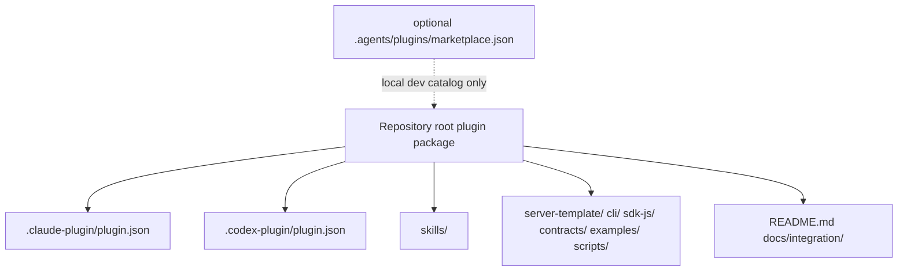
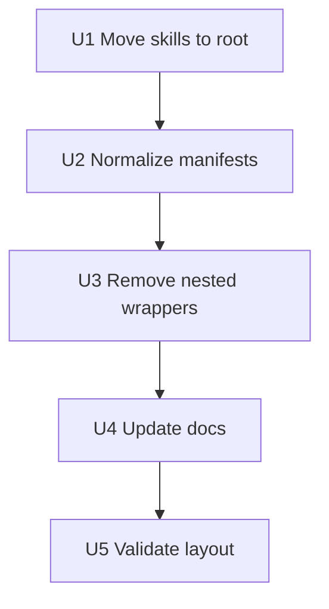

# refactor: Reorganize Plugin Layout Like Superpowers

## Summary

Refactor the Game Designer repository into a Superpowers-style plugin root: host manifests stay at the repository root, skills live in a root-level `skills/` directory, bundled assets remain root-level siblings, and temporary nested plugin wrappers are removed. The goal is a directory layout that Codex and Claude Code can reason about without symlinks, duplicate manifests, or competing plugin roots.

---

## Problem Frame

The current repo grew through troubleshooting: root manifests, `plugin/skills/`, `.agents/plugins/marketplace.json`, and `plugins/game-designer/` now coexist. That solved pieces of discovery experimentally, but it makes the package harder for code agents to install, update, validate, and explain.

The `obra/superpowers` repository provides a cleaner reference shape: the repository root is the plugin root, `.codex-plugin/plugin.json` declares `skills: "./skills/"`, and README installation guidance is organized by agent harness.

---

## Requirements

- R1. Adopt a single repository-root plugin shape inspired by `obra/superpowers`.
- R2. Move the canonical skill source to root-level `skills/` and eliminate `plugin/skills/` as the primary location.
- R3. Remove the temporary `plugins/game-designer/` wrapper and symlink-based discovery path.
- R4. Keep bundled project assets available at repository-root siblings: `server-template/`, `cli/`, `sdk-js/`, `contracts/`, `examples/`, and `scripts/`.
- R5. Update Claude Code and Codex manifests so both reference the same root-level skills path.
- R6. Keep local marketplace support only if it is clearly documented as development scaffolding, not the plugin package itself.
- R7. Update docs and validation so users and agents know how to install, update, build the CLI on first use, and verify the layout.
- R8. Preserve existing MVP behavior and skill names unless a rename is needed for installability.

---

## Scope Boundaries

- In scope: directory reorganization, manifest path updates, docs updates, validation updates, and cleanup of temporary plugin wrapper files.
- In scope: root-level plugin package compatibility for Claude Code and Codex.
- In scope: preserving the server template, CLI source, SDK, contracts, and examples as bundled assets.
- Out of scope: changing backend APIs, SDK runtime behavior, deploy provider behavior, or PaaS integration.
- Out of scope: adding support for additional agent hosts beyond Claude Code and Codex.
- Out of scope: publishing to an official marketplace as part of this refactor.

### Deferred to Follow-Up Work

- Separate marketplace repository: create later if the team wants a catalog that lists multiple Game Designer plugins.
- Release automation: add after the root plugin package shape is stable.
- Public marketplace submission: prepare after local install and update flows are verified.

---

## Context & Research

### Relevant Code and Patterns

- Current repo has root `.claude-plugin/plugin.json` and `.codex-plugin/plugin.json`, but skills still live under `plugin/skills/`.
- Current repo has a temporary `.agents/plugins/marketplace.json` and `plugins/game-designer/.codex-plugin/plugin.json` wrapper created while debugging Codex marketplace discovery.
- `plugins/game-designer/skills` is a symlink to `plugin/skills/`; symlinks are fragile for plugin packaging because installer caches may copy, ignore, or dereference them differently.
- `plugin/README.md` and `plugin/INSTALL.md` split plugin-facing docs away from the root README, which conflicts with the repository-root plugin model.
- `docs/plans/2026-05-16-002-feat-code-agent-plugin-packaging-plan.md` already established that plugin installation does not compile the Go CLI, so first-use CLI setup remains required.

### Institutional Learnings

- No `docs/solutions/` directory exists yet.

### External References

- `obra/superpowers` uses a root `.codex-plugin/plugin.json` with `skills: "./skills/"` and root-level skill discovery.
- `obra/superpowers` README presents installation by harness, including Claude Code and Codex, from the repository entry point.
- `obra/superpowers-marketplace` keeps marketplace catalog metadata in a separate marketplace-oriented repository, rather than making nested plugin wrappers the core plugin source.

---

## Key Technical Decisions

- Make the repository root the only plugin root: all host manifests should describe the root package, not a nested wrapper.
- Move `plugin/skills/` to `skills/`: this matches Superpowers and avoids custom manifest paths.
- Remove `plugins/game-designer/`: the nested wrapper solved a marketplace experiment but creates a second source of truth.
- Treat `.agents/plugins/marketplace.json` as optional local-development catalog metadata: keep it only if it can point to the root plugin without forcing a nested package; otherwise remove it and document direct local install/search expectations.
- Keep assets at root: `server-template/`, `cli/`, `sdk-js/`, `contracts/`, and `examples/` should remain visible siblings of manifests and skills.
- Prefer real directories over symlinks: plugin packages should work when copied into caches on macOS, Linux, Windows, and remote agent environments.

---

## Open Questions

### Resolved During Planning

- Layout reference: use `obra/superpowers` as the directory organization model.
- Primary skill location: root-level `skills/`, not `plugin/skills/`.
- Plugin root: repository root, not `plugin/` or `plugins/game-designer/`.

### Deferred to Implementation

- Codex local marketplace behavior: verify whether local development still needs `.agents/plugins/marketplace.json` after the root-level `.codex-plugin/plugin.json` and `skills/` layout is in place.
- Claude Code custom path support: after moving to root `skills/`, validation should confirm Claude no longer depends on nonstandard `./plugin/skills/` paths.
- Update command wording: confirm the exact local update flow for Codex Desktop after the new root layout is installed.

---

## Output Structure

    .claude-plugin/
      plugin.json
      marketplace.json
    .codex-plugin/
      plugin.json
    skills/
      setup-game-designer-cli/
        SKILL.md
      create-game-server/
        SKILL.md
      connect-js-sdk/
        SKILL.md
      prepare-deploy/
        SKILL.md
      deploy-game-server/
        SKILL.md
      debug-server-integration/
        SKILL.md
    server-template/
    cli/
    sdk-js/
    contracts/
    examples/
    scripts/
      verify-plugin-package.sh
    docs/
      integration/
        plugin-installation.md

Removed or migrated:

    plugin/
    plugins/game-designer/

Optional only if local Codex marketplace still requires it:

    .agents/
      plugins/
        marketplace.json

---

## High-Level Technical Design

> *This illustrates the intended approach and is directional guidance for review, not implementation specification. The implementing agent should treat it as context, not code to reproduce.*

The root package should be installable and understandable without following symlinks or nested wrapper paths. If marketplace metadata is needed for local Codex development, it should point back to this root package and remain clearly secondary.

---

## Implementation Units

### U1. Move Skills to Root-Level `skills/`

**Goal:** Make root `skills/` the canonical skill source, matching the Superpowers plugin layout.

**Requirements:** R1, R2, R8

**Dependencies:** None

**Files:**
- Move: `plugin/skills/create-game-server/SKILL.md` to `skills/create-game-server/SKILL.md`
- Move: `plugin/skills/connect-js-sdk/SKILL.md` to `skills/connect-js-sdk/SKILL.md`
- Move: `plugin/skills/prepare-deploy/SKILL.md` to `skills/prepare-deploy/SKILL.md`
- Move: `plugin/skills/deploy-game-server/SKILL.md` to `skills/deploy-game-server/SKILL.md`
- Move: `plugin/skills/debug-server-integration/SKILL.md` to `skills/debug-server-integration/SKILL.md`
- Create: `skills/setup-game-designer-cli/SKILL.md`
- Test: `scripts/verify-plugin-package.sh`

**Approach:**
- Move existing skill directories without changing skill names.
- Add the planned first-use CLI setup skill if it does not already exist.
- Replace references to `plugin/skills/` in skill prose and docs with `skills/`.
- Preserve skill frontmatter and success/failure output blocks unless path references need correction.

**Patterns to follow:**
- `obra/superpowers` root `skills/` layout.
- Existing Game Designer skill naming and golden-path sequence.

**Test scenarios:**
- Happy path: validation enumerates all expected skill names from root `skills/`.
- Edge case: validation fails if `plugin/skills/` still contains canonical skill files after migration.
- Error path: validation fails if any skill lacks `SKILL.md`.
- Integration: agent manifest skill discovery uses `./skills/` and finds the same golden-path skill set.

**Verification:**
- Root `skills/` is the only canonical skill source.

---

### U2. Normalize Claude Code and Codex Manifests

**Goal:** Align all plugin manifests with the root plugin package and root `skills/` path.

**Requirements:** R1, R5, R6

**Dependencies:** U1

**Files:**
- Modify: `.claude-plugin/plugin.json`
- Modify: `.claude-plugin/marketplace.json`
- Modify: `.codex-plugin/plugin.json`
- Test: `scripts/verify-plugin-package.sh`

**Approach:**
- Set all skill path declarations to `./skills/` where the host manifest supports skill path metadata.
- Keep name, version, description, author, homepage, repository, category, and capability metadata consistent between Claude and Codex manifests.
- Remove metadata that describes nested wrapper paths.
- Keep `.claude-plugin/marketplace.json` only for Claude marketplace/local testing if it points to the root package.

**Patterns to follow:**
- `obra/superpowers/.codex-plugin/plugin.json` metadata shape.
- Existing `.claude-plugin/plugin.json` and `.codex-plugin/plugin.json` field values where they are already correct.

**Test scenarios:**
- Happy path: both manifests parse and declare the same plugin name and version.
- Edge case: validation fails if either manifest points to `plugin/skills/` or `plugins/game-designer/`.
- Error path: validation fails if `skills` path does not exist.
- Integration: a copied repository-root plugin cache can resolve manifests and skills using only paths inside the root package.

**Verification:**
- Claude Code and Codex manifests agree on the root package shape.

---

### U3. Remove Nested Plugin Wrappers and Symlinks

**Goal:** Delete the temporary nested Codex wrapper and avoid duplicate plugin roots.

**Requirements:** R1, R3, R6

**Dependencies:** U2

**Files:**
- Delete: `plugins/game-designer/.codex-plugin/plugin.json`
- Delete: `plugins/game-designer/skills`
- Delete: `plugins/game-designer/`
- Modify or delete: `.agents/plugins/marketplace.json`
- Delete or migrate: `plugin/README.md`
- Delete or migrate: `plugin/INSTALL.md`
- Test: `scripts/verify-plugin-package.sh`

**Approach:**
- Remove `plugins/game-designer/` entirely after root manifests and root `skills/` work.
- Remove `plugin/` after its docs are moved into root README or `docs/integration/plugin-installation.md`.
- Decide whether `.agents/plugins/marketplace.json` remains as local-dev metadata. If retained, it must point to the root package and validation must treat it as optional; if it cannot point to root cleanly, delete it and document local plugin installation another way.
- Ensure no symlinks are needed for plugin discovery.

**Patterns to follow:**
- Superpowers keeps the plugin repo as the root package instead of nesting the same plugin under `plugins/<name>/`.
- Separate marketplace repos may use catalogs, but the plugin repo itself should not need a wrapper to be installable.

**Test scenarios:**
- Happy path: no `plugins/game-designer/` directory exists after cleanup.
- Edge case: validation fails if a symlinked `skills` directory is present under a nested plugin wrapper.
- Error path: validation fails if manifests reference removed paths.
- Integration: local install instructions no longer require choosing between multiple plugin roots.

**Verification:**
- The repository has one plugin root and one skill tree.

---

### U4. Update Installation and Usage Documentation

**Goal:** Make docs explain the Superpowers-style root layout and the correct install/update flows.

**Requirements:** R6, R7, R8

**Dependencies:** U3

**Files:**
- Modify: `README.md`
- Modify: `docs/integration/agent-golden-path.md`
- Modify: `docs/integration/plugin-installation.md`
- Modify: `docs/integration/local-verification.md`
- Modify: `cli/README.md`
- Test: `scripts/verify-plugin-package.sh`

**Approach:**
- Add a root README section similar in spirit to Superpowers: installation differs by harness, with Claude Code and Codex subsections.
- Explain that the repository root is the plugin root and that `skills/` is the canonical skill directory.
- Explain that CLI source ships with the plugin, but the CLI binary is built by `setup-game-designer-cli` or preflight, not during plugin installation.
- Remove instructions that tell users to install `plugin/` or `plugins/game-designer/`.
- Add update guidance for plugin changes and CLI changes, including the need to rerun setup when CLI source version changes.

**Patterns to follow:**
- `obra/superpowers` README harness-by-harness installation section.
- Existing Game Designer quick start and golden path.

**Test scenarios:**
- Happy path: a new user can start at root `README.md` and find Claude Code and Codex install instructions.
- Edge case: docs warn users not to choose nested plugin roots.
- Error path: docs explain how to recover from stale Codex/Claude plugin caches.
- Integration: docs show install, setup CLI, create server, connect SDK, prepare deploy, and deploy as one coherent flow.

**Verification:**
- No user-facing doc still presents `plugin/` or `plugins/game-designer/` as the install root.

---

### U5. Strengthen Package Validation

**Goal:** Add validation that enforces the new root package layout and prevents regression into mixed plugin roots.

**Requirements:** R1, R2, R3, R5, R7

**Dependencies:** U4

**Files:**
- Create or modify: `scripts/verify-plugin-package.sh`
- Modify: `scripts/verify-local.sh`
- Test: `scripts/verify-plugin-package.sh`

**Approach:**
- Validate required directories and files: `.claude-plugin/plugin.json`, `.codex-plugin/plugin.json`, `skills/`, bundled assets, and install docs.
- Reject deprecated paths: canonical `plugin/skills/`, `plugins/game-designer/`, and nested symlinked skill paths.
- Parse skill frontmatter enough to detect missing names, duplicate names, and broken skill directories.
- Check that manifests reference `./skills/`.
- Check that docs do not instruct users to install nested plugin roots.
- Integrate the package validation into the broader local verification path without requiring the Go server to be running.

**Patterns to follow:**
- Existing `scripts/verify-local.sh` structured verification style.
- Superpowers-style root manifest plus root skills convention.

**Test scenarios:**
- Happy path: validation passes on the reorganized root plugin package.
- Edge case: validation fails when `plugin/skills/` reappears with skill files.
- Edge case: validation fails when `plugins/game-designer/` exists.
- Error path: validation fails when `.codex-plugin/plugin.json` points anywhere other than `./skills/`.
- Integration: running local verification includes package layout validation before backend/SDK checks.

**Verification:**
- A code agent can run validation and know the repository matches the intended root plugin layout.

---

## System-Wide Impact

- **Interaction graph:** Root manifests, root skills, docs, validation, and bundled assets become one package contract.
- **Error propagation:** Misplaced skill paths or nested plugin roots should fail package validation before users hit Codex or Claude install confusion.
- **State lifecycle risks:** Existing local Codex/Claude caches may still point at the old nested wrapper; docs should include remove/re-add or reload steps.
- **API surface parity:** Skill names and backend API behavior remain unchanged; only filesystem paths and install instructions change.
- **Integration coverage:** Validation covers plugin layout, while existing Go/TypeScript tests continue to cover server, SDK, CLI, and example behavior.
- **Unchanged invariants:** The MVP backend loop, OpenAPI contract, SDK client methods, CLI deploy lifecycle, and PaaS provider boundary remain unchanged.

---

## Risks & Dependencies

| Risk | Mitigation |
|------|------------|
| Codex local marketplace still requires `plugins/<name>/` layout | Treat `.agents/plugins/marketplace.json` as optional development metadata and verify whether direct root `.codex-plugin` works before deleting the fallback. If it does not, document a separate marketplace repo rather than nesting the plugin inside itself. |
| Moving skills breaks installed plugin caches | Document remove/re-add or reload steps and validate fresh installs from the root package. |
| Docs drift after moving `plugin/README.md` and `plugin/INSTALL.md` | Consolidate install guidance into root README and `docs/integration/plugin-installation.md`, then validate references. |
| Symlink removal exposes missing asset references | Prefer real root-relative paths and run package validation from a fresh checkout. |

---

## Documentation / Operational Notes

- The implementation should not preserve both `plugin/skills/` and `skills/`; doing so invites drift.
- If local Codex plugin discovery cannot consume a root plugin repo directly, create or document a separate marketplace repo shape instead of reintroducing `plugins/game-designer/` inside this repo.
- After the layout changes, users should remove and re-add the local Codex marketplace or reinstall the Claude plugin so caches pick up the new paths.

---

## Sources & References

- Prior packaging plan: [docs/plans/2026-05-16-002-feat-code-agent-plugin-packaging-plan.md](2026-05-16-002-feat-code-agent-plugin-packaging-plan.md)
- MVP requirements: [docs/brainstorms/2026-05-16-game-designer-server-plugin-mvp-requirements.md](../brainstorms/2026-05-16-game-designer-server-plugin-mvp-requirements.md)
- `obra/superpowers` README: [https://github.com/obra/superpowers](https://github.com/obra/superpowers)
- `obra/superpowers` Codex manifest: [https://github.com/obra/superpowers/blob/main/.codex-plugin/plugin.json](https://github.com/obra/superpowers/blob/main/.codex-plugin/plugin.json)
- `obra/superpowers-marketplace` README: [https://github.com/obra/superpowers-marketplace](https://github.com/obra/superpowers-marketplace)
