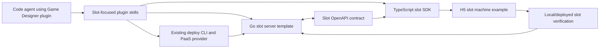

# refactor: Retheme Game Designer Plugin for Slot Machine Games

## Summary

Refactor the existing Game Designer MVP from a generic activity-game backend into a slot machine game backend. The plan keeps the agent-first create/connect/verify/deploy workflow, but changes the golden path, server template, SDK, examples, skills, and docs so a code agent integrates slot-specific behavior: session/profile, slot config, virtual credit balance, authoritative spin resolution, payout results, spin history, and slot-oriented leaderboard verification.

---

## Problem Frame

The current repository implements the original activity-style H5 game MVP around saved progress, score submission, and leaderboard. The new product constraint is narrower: the plugin is mainly for slot machine games, so generic activity-game concepts would guide agents toward the wrong backend shape even if the install and deploy workflow works.

---

## Assumptions

*This plan was authored without synchronous confirmation because the Codex blocking question tool was unavailable in the current mode. These bets should be reviewed before implementation proceeds.*

- The target is entertainment or campaign-style slot machine gameplay with virtual credits, not real-money gambling, payments, withdrawal, rewards fulfillment, or regulated gaming compliance.
- The refactor may be a breaking API/theme change because the existing implementation is still an MVP plugin, not a published stable contract.
- Slot spin outcomes should be server-authoritative in the template so the client does not invent payouts or mutate balances locally.

---

## Requirements

- R1. Preserve the agent-first workflow from the origin: create or attach backend, connect SDK, verify locally, prepare deploy, deploy, and debug failures.
- R2. Retheme the plugin around one slot machine golden path rather than generic activity-game state and score flows.
- R3. Update the OpenAPI contract so slot machine concepts are explicit: slot config, virtual credit balance, spin request, reel symbols, paylines, payout, spin history, and slot leaderboard.
- R4. Update the Go server template to resolve spins authoritatively, validate wagers/paylines, update virtual credits atomically, and expose slot-specific read APIs.
- R5. Update the TypeScript SDK so H5 slot games use typed slot methods instead of generic `saveGameState`, `submitScore`, and `getLeaderboard` examples.
- R6. Update all plugin skills so code agents discover and execute slot-machine-specific guidance, checks, success output, and failure triage.
- R7. Update verification scripts and tests so local and deployed verification prove a complete slot spin loop, not merely session plus score submission.
- R8. Update examples and documentation so install, golden path, SDK usage, troubleshooting, and README language consistently describe slot machine games.
- R9. Preserve deployment CLI/provider behavior unless slot-specific preflight metadata is needed; this refactor should not expand the PaaS scope.

**Origin actors:** A1 product/operations H5 mini-game creator, A2 code agent, A3 backend/platform maintainer, A4 game player, A5 team PaaS
**Origin flows:** F1 agent connects an H5 game to the backend, F2 agent deploys the connected backend to the team PaaS, F3 player completes the backend-backed game loop
**Origin acceptance examples:** AE1 backend connection, AE2 PaaS deploy, AE3 deployed game loop, AE4 contract-aligned SDK update

---

## Scope Boundaries

- In scope: retheming this MVP repository for slot machine H5 games across skills, server template, SDK, contract, examples, verification, and docs.
- In scope: virtual credit balance and payout accounting inside the template.
- In scope: deterministic test hooks for spin outcome and payout verification.
- In scope: slot leaderboard semantics such as highest single payout, best balance, or configured MVP ranking rule.
- Out of scope: real-money wagering, payments, withdrawal, redemption, rewards, entitlement issuance, KYC, AML, regional gambling compliance, and production-grade fairness certification.
- Out of scope: complex casino platform features such as multi-game catalogs, progressive jackpots, tournaments, live operations consoles, and economy management.
- Out of scope: changing the PaaS provider abstraction beyond terminology and metadata needed by verification.

### Deferred to Follow-Up Work

- Regulatory and fairness hardening: if this becomes real-money or regulated gameplay, create a separate requirements pass before implementation.
- Multi-slot catalog support: this plan targets one template slot game configuration, not a marketplace of reels/paytables.
- Advanced anti-abuse controls: basic validation belongs here; fraud detection, device fingerprinting, and risk scoring should be planned separately.

---

## Context & Research

### Relevant Code and Patterns

- `skills/create-game-server/SKILL.md`, `skills/connect-js-sdk/SKILL.md`, `skills/prepare-deploy/SKILL.md`, `skills/deploy-game-server/SKILL.md`, `skills/debug-server-integration/SKILL.md`, and `skills/setup-game-designer-cli/SKILL.md` are the agent-facing workflow surface that currently says activity game, score, state, and leaderboard.
- `contracts/game-server.openapi.yaml` is the contract source used by docs, SDK expectations, and validation.
- `server-template/internal/session/`, `server-template/internal/profile/`, `server-template/internal/gamestate/`, `server-template/internal/leaderboard/`, `server-template/internal/http/`, and `server-template/internal/store/` show the current domain split and test style.
- `sdk-js/src/client.ts`, `sdk-js/src/types.ts`, `sdk-js/src/client.test.ts`, and `sdk-js/examples/basic-activity-game.ts` contain the H5-facing generic API and example.
- `examples/h5-activity-game/` demonstrates the current end-to-end loop; this plan standardizes the new example path as `examples/h5-slot-machine/`.
- `scripts/verify-local.sh` and `scripts/verify-deployed.sh` are the agent-readable verification gates that must exercise the slot loop after the refactor.

### Institutional Learnings

- No `docs/solutions/` directory exists, so there are no local solution notes to preserve.

### External References

- No external research was used. Local patterns are sufficient for planning because this is a repository-wide theme and domain refactor rather than adoption of a new framework or external API.

---

## Key Technical Decisions

- Server-authoritative spin resolution: the template should accept a spin request and return reels, paylines, payout, and balance updates from the backend instead of trusting client-submitted scores.
- Virtual credits only: use neutral virtual credit terminology and explicitly avoid real-money or rewards language in API, examples, skills, and docs.
- Replace generic score submission with slot outcomes: retire or rename `submitScore`-centered flows in favor of `spin` and slot leaderboard semantics.
- Keep session/profile capabilities: player identity remains part of the original golden path and is still needed for balances, history, and ranking.
- Use injectable deterministic spin logic in tests: production template defaults can be simple, but tests need deterministic reels/outcomes to validate payout and balance behavior.
- Preserve deploy CLI boundaries: deployment remains a generic server deploy lifecycle; only preflight/docs should learn enough slot metadata to verify the correct template.

---

## Open Questions

### Resolved During Planning

- Should this be docs-only or behavior-bearing? Behavior-bearing, because the server template and SDK would otherwise still be generic activity-game infrastructure.
- Should real-money/rewards be included because slot machines can imply gambling? No; this plan scopes to virtual credits and explicitly defers regulated or monetary features.
- Should the deployment provider be redesigned? No; the user's request targets skills and server template theme, and the current provider boundary can remain.

### Deferred to Implementation

- Exact MVP leaderboard rule: choose and document one rule during implementation, such as highest single payout or highest virtual balance, then keep contract, SDK, and tests aligned.
- Exact default reel/paytable values: use simple deterministic-friendly defaults, with final symbol names and payout multipliers chosen during implementation.
- Compatibility aliases: decide during implementation whether old SDK methods should be removed, deprecated, or temporarily retained if package consumers already exist.

---

## High-Level Technical Design

> *This illustrates the intended approach and is directional guidance for review, not implementation specification. The implementing agent should treat it as context, not code to reproduce.*

The new golden path should read as: create slot backend, connect slot SDK, start or resume a player session, fetch slot config and balance, request a spin with a virtual-credit wager, render returned reels/paylines/payout, read spin history or slot leaderboard, verify locally, and deploy through the existing CLI.

---

## Implementation Units

### U1. Redefine the Contract Around Slot Machine Gameplay

**Goal:** Replace the generic activity-game API contract language and schemas with slot-machine-specific capabilities while preserving session/profile and agent-readable errors.

**Requirements:** R1, R2, R3, R7

**Dependencies:** None

**Files:**
- Modify: `contracts/game-server.openapi.yaml`
- Modify: `contracts/README.md`
- Modify: `contracts/test/validate-contract.mjs`
- Modify: `docs/integration/contract-first-workflow.md`
- Test: `contracts/test/validate-contract.mjs`

**Approach:**
- Keep `POST /api/v1/session` and profile endpoints unless implementation discovers a strong reason to change them.
- Replace generic game-state and score schemas with slot-specific schemas such as slot config, balance, spin request, spin result, reel window, symbol, payline win, payout, and spin history.
- Define one clear leaderboard/ranking endpoint only if it has slot-specific semantics; avoid preserving generic score language by inertia.
- Update validation expectations so contract checks fail if the API title/description and required slot operations drift back to activity-game language.

**Patterns to follow:**
- Keep the current single-file OpenAPI layout in `contracts/game-server.openapi.yaml`.
- Preserve structured error shape and status-code patterns from the current contract.

**Test scenarios:**
- Happy path: contract validation accepts a document that includes session, slot config, balance, spin, history, and slot leaderboard operations.
- Edge case: validation catches a missing spin operation or missing required spin result fields such as reels, payout, and balance.
- Error path: validation rejects stale generic operation names or descriptions that still describe activity-game score submission as the golden path.
- Integration: SDK/server readers can still consume the contract without manual path rewrites.

**Verification:**
- The contract describes a slot spin loop end to end and no longer presents generic score submission as the primary gameplay action.

---

### U2. Refactor the Go Server Template to Resolve Slot Spins

**Goal:** Turn the Go template from session/state/score services into a slot-focused backend that validates wagers, resolves spins, updates virtual credits, and records spin outcomes.

**Requirements:** R2, R4, R7

**Dependencies:** U1

**Files:**
- Modify: `server-template/cmd/server/main.go`
- Modify: `server-template/internal/http/handlers.go`
- Modify: `server-template/internal/store/store.go`
- Modify: `server-template/README.md`
- Create: `server-template/internal/slot/`
- Create: `server-template/internal/balance/`
- Modify or remove: `server-template/internal/gamestate/`
- Modify or remove: `server-template/internal/leaderboard/`
- Test: `server-template/internal/slot/slot_test.go`
- Test: `server-template/internal/balance/balance_test.go`
- Test: `server-template/internal/http/http_integration_test.go`
- Test: `server-template/internal/store/store_test.go`

**Approach:**
- Introduce a slot service that owns spin validation, reel generation, payline evaluation, payout calculation, balance mutation, and spin-history persistence.
- Keep random outcome generation behind a narrow interface so tests can inject deterministic reels and assert exact payouts.
- Treat balance updates as one atomic store operation: reject insufficient credits, deduct wager, apply payout, and store the final spin record consistently.
- Replace generic score/leaderboard state with a slot ranking rule chosen during implementation and documented in contract/docs.
- Keep the in-memory store swappable, matching the existing local-dev template posture.

**Execution note:** Add characterization tests around existing session/profile behavior before moving handler wiring, then implement slot behavior test-first.

**Patterns to follow:**
- Current service-per-domain layout in `server-template/internal/session/`, `server-template/internal/profile/`, `server-template/internal/gamestate/`, and `server-template/internal/leaderboard/`.
- Current HTTP integration style in `server-template/internal/http/http_integration_test.go`.

**Test scenarios:**
- Happy path: authenticated player with enough virtual credits spins with a valid wager and receives reels, payline evaluation, payout, and updated balance.
- Happy path: repeated spins append spin history and update the slot leaderboard according to the chosen MVP ranking rule.
- Edge case: zero wager, negative wager, unsupported payline count, or over-limit wager returns `INVALID_PARAMETERS`.
- Edge case: player with insufficient virtual credits receives a structured failure and balance is unchanged.
- Edge case: deterministic spin outcome with no winning paylines deducts only the wager and records zero payout.
- Error path: missing or expired session token prevents spin, balance, history, and leaderboard reads.
- Integration: HTTP-level test exercises session creation, balance/config read, spin, history read, and leaderboard read through public routes.

**Verification:**
- Go tests prove the template's slot loop is server-authoritative and internally consistent across handlers, services, and store state.

---

### U3. Update the TypeScript SDK and Example to Slot APIs

**Goal:** Make H5 integration code read like a slot machine client, with typed methods and examples that an agent can copy without inventing backend calls.

**Requirements:** R1, R2, R5, R7, R8

**Dependencies:** U1, U2

**Files:**
- Modify: `sdk-js/src/client.ts`
- Modify: `sdk-js/src/types.ts`
- Modify: `sdk-js/src/client.test.ts`
- Modify: `sdk-js/README.md`
- Create: `sdk-js/examples/basic-slot-machine.ts`
- Modify or remove: `sdk-js/examples/basic-activity-game.ts`
- Create: `examples/h5-slot-machine/package.json`
- Create: `examples/h5-slot-machine/src/game.ts`
- Create: `examples/h5-slot-machine/src/game.test.ts`
- Create: `examples/h5-slot-machine/README.md`
- Modify or remove: `examples/h5-activity-game/`
- Test: `sdk-js/src/client.test.ts`
- Test: `examples/h5-slot-machine/src/game.test.ts`

**Approach:**
- Add slot-facing SDK methods such as `getSlotConfig`, `getBalance`, `spin`, `getSpinHistory`, and `getSlotLeaderboard`.
- Update SDK types around `SpinRequest`, `SpinResult`, `ReelWindow`, `PaylineWin`, `Payout`, `BalanceResponse`, and `SlotLeaderboardEntry`.
- Replace example gameplay with a minimal slot loop: create session, load config/balance, perform a spin, render reels/payout, and read history/leaderboard.
- Avoid client-side payout calculation in examples except for display; the example should trust server-returned spin results.
- Decide during implementation whether old methods are removed or kept as compatibility shims, then make tests reflect that choice.

**Patterns to follow:**
- Current `GameDesignerClient` request wrapper and `ApiError` handling in `sdk-js/src/client.ts`.
- Current mock-fetch testing style in `sdk-js/src/client.test.ts`.
- Current example package/test structure under `examples/h5-activity-game/`, adapted into `examples/h5-slot-machine/`.

**Test scenarios:**
- Happy path: SDK sends a spin request with wager/paylines and returns typed reels, payout, and balance fields.
- Happy path: example completes the slot golden path using mocked SDK/server responses.
- Edge case: SDK correctly handles a no-win spin with zero payout and a lower final balance.
- Error path: SDK turns invalid wager or insufficient balance server errors into `ApiError` with structured codes/details.
- Integration: example code does not make hand-written fetch calls for slot endpoints and only uses SDK methods.

**Verification:**
- SDK tests and example tests demonstrate the slot loop and no longer depend on generic `submitScore` as the central gameplay action.

---

### U4. Rewrite Agent Skills for Slot Machine Workflows

**Goal:** Make the installed skills guide agents toward slot machine backend setup, SDK integration, verification, deployment, and debugging.

**Requirements:** R1, R2, R6, R8, R9

**Dependencies:** U1, U2, U3

**Files:**
- Modify: `skills/create-game-server/SKILL.md`
- Modify: `skills/connect-js-sdk/SKILL.md`
- Modify: `skills/prepare-deploy/SKILL.md`
- Modify: `skills/deploy-game-server/SKILL.md`
- Modify: `skills/debug-server-integration/SKILL.md`
- Modify: `skills/setup-game-designer-cli/SKILL.md`
- Modify: `scripts/verify-plugin-package.sh`
- Test: `scripts/verify-plugin-package.sh`

**Approach:**
- Update skill descriptions, triggers, read/write scopes, success outputs, and failure outputs to use slot-machine vocabulary.
- In `create-game-server`, verify slot-specific endpoints such as session plus config or balance, not only `POST /session`.
- In `connect-js-sdk`, point agents to the slot SDK example and require spin/balance/history handling instead of save-progress/submit-score wiring.
- In `prepare-deploy` and `deploy-game-server`, keep CLI lifecycle steps but make readiness and deployed verification assert the slot loop.
- In `debug-server-integration`, add failure categories for invalid wager, insufficient virtual credits, payout mismatch, stale contract types, and spin verification failures.
- Extend package verification so stale activity-game terms in skill headers or examples are caught where practical.

**Patterns to follow:**
- Existing skill structure with prerequisites, when-to-apply, read/write scope, checks, success output, and failure output.
- Existing script-based package validation in `scripts/verify-plugin-package.sh`.

**Test scenarios:**
- Happy path: package validation passes when all six skills describe the slot backend workflow and reference existing slot example paths.
- Edge case: validation catches a skill still pointing to `sdk-js/examples/basic-activity-game.ts` after the example is renamed.
- Error path: debug guidance maps an insufficient-balance spin failure to an actionable category.
- Integration: skills form a coherent sequence from setup through deployed verification without mixing activity-game and slot-machine terminology.

**Verification:**
- A code agent reading only the skill files can identify the slot-machine golden path and the correct files/scripts to inspect or run.

---

### U5. Retheme Verification, Documentation, and Repository Entry Points

**Goal:** Make every user-facing and agent-facing repository entry point reinforce the slot machine product shape.

**Requirements:** R1, R2, R7, R8, R9

**Dependencies:** U1, U2, U3, U4

**Files:**
- Modify: `README.md`
- Modify: `docs/integration/agent-golden-path.md`
- Modify: `docs/integration/sdk-usage.md`
- Modify: `docs/integration/local-verification.md`
- Modify: `docs/integration/plugin-installation.md`
- Modify: `docs/deployment/deployed-verification.md`
- Modify: `docs/deployment/troubleshooting.md`
- Modify: `scripts/verify-local.sh`
- Modify: `scripts/verify-deployed.sh`
- Modify: `examples/h5-slot-machine/README.md`
- Test: `scripts/verify-local.sh`
- Test: `scripts/verify-deployed.sh`

**Approach:**
- Update README quick start and capability tables to describe slot config, balance, spin, payout, history, and slot leaderboard.
- Update golden-path docs so the agent flow is slot-specific from the first step.
- Update local/deployed verification scripts to exercise a slot spin loop with deterministic or assertion-friendly outcomes where possible.
- Update troubleshooting docs with slot failure modes: invalid wager, insufficient balance, payout mismatch, missing slot config, stale SDK types, and deployed spin endpoint failures.
- Search the repository for stale generic activity-game phrasing after implementation and keep only intentional historical references in older plans/brainstorms.

**Patterns to follow:**
- Current docs split between `docs/integration/` and `docs/deployment/`.
- Current JSON-style success/failure output from verification scripts.

**Test scenarios:**
- Happy path: `verify-local` confirms contract validation, server tests, SDK tests, CLI tests, example tests, and a local slot loop when a server is available.
- Happy path: `verify-deployed` checks health plus session/config/balance/spin/history or leaderboard against a deployed URL.
- Edge case: verification skips or reports unavailable live-server checks in the same agent-readable style used today.
- Error path: deployed verification reports which slot endpoint failed and whether the likely cause is auth, contract drift, balance state, or server availability.
- Integration: docs and scripts point to the same slot example paths and SDK method names.

**Verification:**
- Repository quick start and verification output prove the slot machine backend loop and no longer advertise the generic activity-game score loop as the MVP.

---

## System-Wide Impact

- **Interaction graph:** Contract changes drive server handlers, SDK methods, examples, skills, docs, and verification scripts; U1 should land before behavior and documentation rewrites.
- **Error propagation:** Slot-specific validation errors need stable codes/details so SDK, debug skill, and verification scripts can diagnose invalid wager, insufficient credits, and contract drift.
- **State lifecycle risks:** Spin resolution must keep wager deduction, payout application, history write, and leaderboard update consistent; partial updates would make the template misleading.
- **API surface parity:** OpenAPI paths, Go handler routes, TypeScript method names, docs examples, and verification scripts must agree on the same slot vocabulary.
- **Integration coverage:** Unit tests alone are not enough; HTTP integration plus SDK/example verification must prove the complete player spin loop.
- **Unchanged invariants:** CLI deployment lifecycle, provider abstraction, plugin installation flow, session/profile identity model, and structured error posture should remain intact unless implementation exposes a direct mismatch.

---

## Risks & Dependencies

| Risk | Mitigation |
|------|------------|
| Slot machine wording accidentally implies real-money gambling support | Use virtual credits only, avoid payment/reward terms, and document real-money/regulatory work as out of scope. |
| Superficial retheme leaves generic score/state behavior underneath | Make server, SDK, contract, tests, and verification behavior-bearing units, not just documentation edits. |
| Contract, SDK, and Go handlers drift during refactor | Start with U1 contract changes, then align server and SDK tests to the same slot schemas. |
| Random spin outcomes make tests flaky | Inject deterministic spin outcome providers in tests and keep random defaults isolated. |
| Breaking API changes surprise downstream users | Decide compatibility/deprecation during implementation and document the change clearly in README and SDK docs. |
| Verification becomes too heavy for agent iteration | Keep local checks fast and deterministic; reserve deployed checks for health plus one minimal slot loop. |

---

## Documentation / Operational Notes

- Update plugin installation docs only where theme and first-use expectations change; install mechanics should remain stable.
- Keep older brainstorm and completed plan files as historical artifacts unless the team explicitly wants them revised; active docs and skills should represent the current slot-machine direction.
- Add a short note in troubleshooting that this template is not a real-money gaming backend and does not provide compliance, payment, or withdrawal guarantees.

---

## Sources & References

- **Origin document:** [docs/brainstorms/2026-05-16-game-designer-server-plugin-mvp-requirements.md](../brainstorms/2026-05-16-game-designer-server-plugin-mvp-requirements.md)
- Related plan: [docs/plans/2026-05-16-001-feat-game-designer-server-plugin-mvp-plan.md](2026-05-16-001-feat-game-designer-server-plugin-mvp-plan.md)
- Related code: `skills/`, `contracts/game-server.openapi.yaml`, `server-template/`, `sdk-js/`, `examples/h5-activity-game/`, `scripts/verify-local.sh`, `scripts/verify-deployed.sh`
