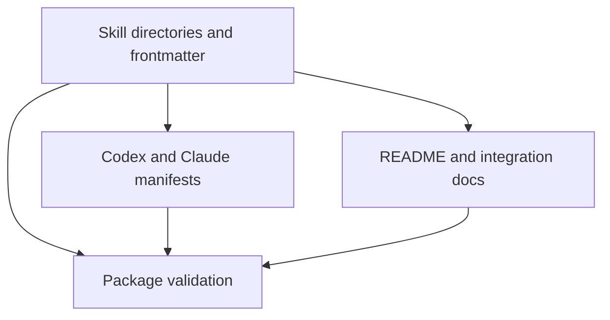
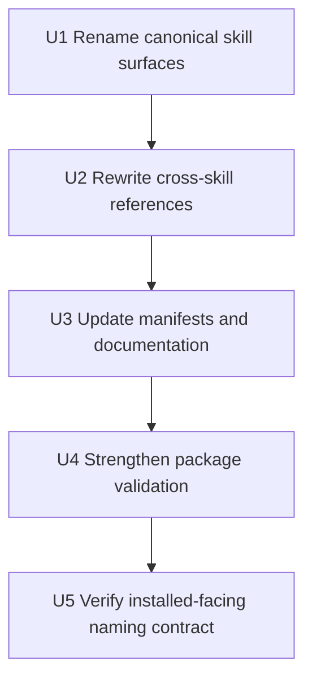

# refactor: Prefix and Shorten Skill Names

## Summary

Rename the Game Designer plugin's public skill names to a consistent short `gd-` prefix, while preserving the existing golden-path workflow. The implementation should update skill directories, skill frontmatter, cross-skill references, plugin prompts, docs, and package validation together so agents see one coherent naming surface.

---

## Problem Frame

The plugin now exposes generic names like `create-game-server`, `connect-js-sdk`, and `prepare-deploy`. They are understandable inside this repository, but once installed into an agent environment with many skills, the names are longer than necessary, not obviously tied to Game Designer, and more collision-prone than a project-prefixed set.

---

## Requirements

- R1. All Game Designer skills must use a shared short project prefix in their public `name` metadata.
- R2. Skill names should be shorter while remaining clear in the agent golden path.
- R3. Skill directory names, headings, and internal cross-skill references must stay aligned with the public skill names.
- R4. Plugin manifests and default prompts must reference the renamed skills.
- R5. User-facing docs must teach the renamed skills and avoid advertising stale old names as current invocation targets.
- R6. Package validation must fail when old skill names remain in public invocation surfaces or when directory/frontmatter names drift.
- R7. The rename must not change backend, SDK, CLI, deploy provider, or verification behavior.

**Origin actors:** A1 Product/operations H5 mini-game creator, A2 Code agent, A3 Backend/platform maintainer
**Origin flows:** F1 Agent connects an H5 game to the backend, F2 Agent deploys the connected backend to the team PaaS
**Origin acceptance examples:** AE1 agent connects backend without manual API design, AE2 agent deploys and reports clear result

---

## Scope Boundaries

- In scope: renaming the six existing plugin skills, updating references, and strengthening validation around the naming contract.
- In scope: preserving the current skill split and golden-path order.
- In scope: documenting the new names as the canonical invocation surface.
- Out of scope: adding new skills, folding skills together, or changing what each skill does.
- Out of scope: changing server template APIs, SDK method names, CLI commands, deploy provider behavior, or slot-machine game behavior.
- Out of scope: maintaining old public skill names as aliases in this refactor.

### Deferred to Follow-Up Work

- Backward-compatible aliases: add later only if a target host supports first-class skill aliases and installed-user migration needs justify the extra surface.
- Release notes or changelog entry: add when the plugin has a formal release workflow.

---

## Context & Research

### Relevant Code and Patterns

- `.codex-plugin/plugin.json` and `.claude-plugin/plugin.json` both point to root `skills/`, so the root-level skill directory names and each `SKILL.md` frontmatter are the canonical discovery surface.
- `.codex-plugin/plugin.json` includes `interface.defaultPrompt` entries that invoke the current old names.
- `skills/*/SKILL.md` files use the old names in frontmatter, H1 headings, prerequisites, failure guidance, and next-step handoffs.
- `README.md`, `cli/README.md`, `docs/integration/plugin-installation.md`, and `docs/integration/agent-golden-path.md` all expose the current skill names to users and agents.
- `scripts/verify-plugin-package.sh` already validates root `skills/`, required frontmatter, duplicate skill names, and documentation references. It is the right place to add name-prefix and stale-name checks.

### Institutional Learnings

- No `docs/solutions/` directory exists yet.
- `docs/plans/2026-05-16-003-refactor-superpowers-style-plugin-layout-plan.md` established that the repository root and root `skills/` directory are the plugin package contract.

### External References

- External research is not needed for this plan. The work is a local naming-contract refactor with established repository patterns and no high-risk external API surface.

---

## Key Technical Decisions

- Use `gd-` as the canonical prefix: it is short enough for frequent agent invocation while still tying the skills to Game Designer.
- Rename the six public skills as one coordinated change rather than piecemeal: partial renames would make the plugin difficult for agents to reason about.
- Keep the existing workflow verbs but trim repeated domain words: the prefix carries "Game Designer", so names should focus on the step.
- Treat old names as stale public surface after the rename: validation should catch them in manifests, active docs, and skill cross-references.
- Do not introduce alias wrappers in this refactor: duplicate skill entries would make discovery noisier and could undermine the simplification goal.

---

## Open Questions

### Resolved During Planning

- Prefix: use `gd-`.
- Compatibility posture: one-time canonical rename, no old-name aliases in the active skill set.
- Skill count and workflow: keep the current six-skill golden path.

### Deferred to Implementation

- Exact wording polish in each skill body: implementation should update prose enough to read naturally after the rename without expanding the scope of each skill.
- Host-specific display behavior: after implementation, verify whether Claude Code and Codex show directory names, frontmatter names, or both, and adjust validation if one host exposes an additional name surface.

---

## High-Level Technical Design

> *This illustrates the intended approach and is directional guidance for review, not implementation specification. The implementing agent should treat it as context, not code to reproduce.*

| Current skill | New skill |
| --- | --- |
| `setup-game-designer-cli` | `gd-setup-cli` |
| `create-game-server` | `gd-create-server` |
| `connect-js-sdk` | `gd-connect-sdk` |
| `prepare-deploy` | `gd-prepare-deploy` |
| `deploy-game-server` | `gd-deploy-server` |
| `debug-server-integration` | `gd-debug-integration` |

The rename should be applied as a package-level contract change:

---

## Implementation Units

### U1. Rename Canonical Skill Surfaces

**Goal:** Make each skill's directory, frontmatter `name`, and visible heading use the new `gd-` name.

**Requirements:** R1, R2, R3, R7

**Dependencies:** None

**Files:**
- Move: `skills/setup-game-designer-cli/SKILL.md` to `skills/gd-setup-cli/SKILL.md`
- Move: `skills/create-game-server/SKILL.md` to `skills/gd-create-server/SKILL.md`
- Move: `skills/connect-js-sdk/SKILL.md` to `skills/gd-connect-sdk/SKILL.md`
- Move: `skills/prepare-deploy/SKILL.md` to `skills/gd-prepare-deploy/SKILL.md`
- Move: `skills/deploy-game-server/SKILL.md` to `skills/gd-deploy-server/SKILL.md`
- Move: `skills/debug-server-integration/SKILL.md` to `skills/gd-debug-integration/SKILL.md`
- Test: `scripts/verify-plugin-package.sh`

**Approach:**
- Move each directory to the new name and update the `name:` frontmatter to match exactly.
- Update each skill's top-level heading to the same name so rendered skill docs do not show stale identifiers.
- Preserve descriptions, trigger intent, prerequisites, editable surfaces, and success/failure behavior except where wording must reflect the rename.

**Patterns to follow:**
- Existing root `skills/` layout established by the Superpowers-style plugin refactor.
- Existing `scripts/verify-plugin-package.sh` checks that enumerate `skills/*/SKILL.md`.

**Test scenarios:**
- Happy path: package validation discovers exactly the renamed `gd-` skill directories and each `name:` value matches its directory.
- Edge case: validation fails when a skill directory uses a `gd-` name but frontmatter still contains an old name.
- Error path: validation fails if any old-name directory remains under `skills/` with a `SKILL.md`.

**Verification:**
- The root skill tree exposes the six new names and no old-name skill directories remain.
- Each skill file still has valid frontmatter and a readable description.

### U2. Rewrite Cross-Skill References

**Goal:** Update skill-to-skill handoffs so agents following one skill are always pointed to the renamed next skill.

**Requirements:** R2, R3, R7

**Dependencies:** U1

**Files:**
- Modify: `skills/gd-setup-cli/SKILL.md`
- Modify: `skills/gd-create-server/SKILL.md`
- Modify: `skills/gd-connect-sdk/SKILL.md`
- Modify: `skills/gd-prepare-deploy/SKILL.md`
- Modify: `skills/gd-deploy-server/SKILL.md`
- Modify: `skills/gd-debug-integration/SKILL.md`
- Test: `scripts/verify-plugin-package.sh`

**Approach:**
- Replace prerequisites, troubleshooting guidance, and next-step mentions of old names with the new names.
- Keep the golden-path order intact: setup CLI, create server, connect SDK, prepare deploy, deploy server, debug integration.
- Avoid changing command examples or runtime behavior unless they mention a skill invocation name.

**Patterns to follow:**
- Current skill bodies already include concise handoff sections and failure guidance; update those in place rather than redesigning the workflow prose.

**Test scenarios:**
- Happy path: a search over active skill files finds all expected new names in their handoff contexts.
- Edge case: package validation fails when an old skill name appears in a skill handoff or prerequisite.
- Integration: `gd-deploy-server` points failure paths to `gd-prepare-deploy`, `gd-setup-cli`, and `gd-debug-integration` where appropriate.

**Verification:**
- A reader can start from any skill and follow the named next step without encountering stale invocation names.

### U3. Update Manifests and User-Facing Documentation

**Goal:** Make plugin prompts and public docs teach only the canonical renamed skill set.

**Requirements:** R4, R5, R7

**Dependencies:** U1, U2

**Files:**
- Modify: `.codex-plugin/plugin.json`
- Modify: `README.md`
- Modify: `cli/README.md`
- Modify: `docs/integration/plugin-installation.md`
- Modify: `docs/integration/agent-golden-path.md`
- Test: `scripts/verify-plugin-package.sh`

**Approach:**
- Update Codex `interface.defaultPrompt` to use the renamed setup, create, and connect skills.
- Update quick-start and installation instructions so user-visible examples use `$gd-...` invocation names.
- Preserve documentation structure and slot-machine terminology; this is a naming cleanup, not another theme or workflow refactor.
- Avoid changing historical plan and brainstorm documents unless the implementation deliberately scopes a generated-doc cleanup. Historical artifacts can preserve old names as prior context.

**Patterns to follow:**
- Current README and integration docs already organize the golden path clearly; keep that organization and swap the public skill identifiers.
- Prior plans are treated as historical records, not active invocation docs.

**Test scenarios:**
- Happy path: active user-facing docs list the six renamed skills in the golden path.
- Edge case: validation allows old names in historical `docs/plans/` and `docs/brainstorms/` artifacts but fails if active installation or golden-path docs advertise old names.
- Error path: validation fails if `.codex-plugin/plugin.json` default prompts reference old names.

**Verification:**
- New users following the README or installation docs see the `gd-` naming surface from install through deploy.

### U4. Strengthen Package Validation

**Goal:** Encode the skill naming convention so future edits cannot silently reintroduce old names or drift between directory and frontmatter.

**Requirements:** R1, R3, R4, R5, R6

**Dependencies:** U1, U2, U3

**Files:**
- Modify: `scripts/verify-plugin-package.sh`

**Approach:**
- Add validation that all discovered public skill names start with `gd-`.
- Add validation that every skill directory name matches the `name:` frontmatter.
- Add a stale-name scan over active public surfaces: manifests, README, integration docs, deployment docs, CLI README, and skill files.
- Keep historical artifacts excluded from stale-name failure checks so prior planning records do not need churn.
- Keep validation output structured enough for agents to identify which stale surface needs fixing.

**Patterns to follow:**
- Existing validation sections for manifest fields, skill discovery, docs accuracy, and theme consistency.
- Existing script convention of clear PASS/FAIL lines plus a final JSON summary.

**Test scenarios:**
- Happy path: package validation passes when all active surfaces use the `gd-` names.
- Edge case: validation fails when a skill directory is renamed but frontmatter is not.
- Edge case: validation fails when an active doc includes an old invocation name.
- Error path: validation reports the stale file or skill name clearly enough for an agent to fix it without re-reading the whole repository.

**Verification:**
- The validation script enforces the naming convention, not just the presence of six skills.

### U5. Verify Installed-Facing Naming Contract

**Goal:** Confirm the renamed skill set is coherent from the perspective of an installed plugin and document any host-specific discovery caveat.

**Requirements:** R1, R4, R5, R6

**Dependencies:** U4

**Files:**
- Modify: `docs/integration/plugin-installation.md`
- Modify: `docs/integration/local-verification.md`
- Test: `scripts/verify-plugin-package.sh`

**Approach:**
- Use package validation as the primary repo-level guard.
- Check the installed-facing surfaces that the repo can control: manifest prompt names, root skill names, and docs.
- If implementation reveals host behavior that displays directory names separately from frontmatter names, capture the caveat in installation or verification docs and adjust validation to cover it.

**Patterns to follow:**
- Existing installation docs distinguish plugin install, CLI build, server create, and deploy phases.
- Existing local verification docs describe package validation as the first check.

**Test scenarios:**
- Happy path: a fresh package validation reports six renamed skills.
- Integration: Codex default prompt entries line up with real renamed skill names.
- Integration: Claude and Codex manifests continue to share the same root `skills/` path after the rename.

**Verification:**
- The plugin package presents one public naming convention across manifests, docs, and skill files.

---

## System-Wide Impact

- **Interaction graph:** Skill names are consumed by plugin discovery, Codex default prompts, installation docs, golden-path docs, skill handoffs, CLI README guidance, and package validation.
- **Error propagation:** Stale old names should fail validation before users install the plugin and discover broken or confusing invocations.
- **State lifecycle risks:** No persistent app state or data migration is involved.
- **API surface parity:** Runtime APIs, SDK methods, CLI commands, OpenAPI contracts, and deploy provider behavior remain unchanged.
- **Integration coverage:** The important integration check is package-level consistency across manifest discovery, skill metadata, and docs.
- **Unchanged invariants:** The six-step workflow, bundled assets, root plugin layout, and slot-machine backend behavior remain intact.

---

## Risks & Dependencies

| Risk | Mitigation |
|------|------------|
| Installed users or docs still mention old names | Update active docs and add stale-name validation for public invocation surfaces. |
| Host discovery uses directory names and frontmatter names differently | Rename both surfaces together and verify directory/frontmatter equality. |
| Validation becomes too broad and fails on historical plan artifacts | Restrict stale-name checks to active user-facing docs, manifests, and skill files. |
| Short names become ambiguous without context | Use the `gd-` prefix consistently and preserve descriptive verbs after the prefix. |

---

## Documentation / Operational Notes

- Installation and golden-path docs should present the renamed names as canonical, not as an optional alternate spelling.
- Any release note should call this out as a breaking skill invocation rename if the plugin has already been shared with other users.
- Users with a cached installed plugin may need to reload or reinstall after the rename, following the existing stale-cache troubleshooting guidance.

---

## Sources & References

- **Origin document:** [docs/brainstorms/2026-05-16-game-designer-server-plugin-mvp-requirements.md](../brainstorms/2026-05-16-game-designer-server-plugin-mvp-requirements.md)
- Related plan: [docs/plans/2026-05-16-003-refactor-superpowers-style-plugin-layout-plan.md](2026-05-16-003-refactor-superpowers-style-plugin-layout-plan.md)
- Related code: `.codex-plugin/plugin.json`
- Related code: `.claude-plugin/plugin.json`
- Related code: `skills/*/SKILL.md`
- Related code: `scripts/verify-plugin-package.sh`
- Related docs: `README.md`
- Related docs: `docs/integration/plugin-installation.md`
- Related docs: `docs/integration/agent-golden-path.md`
