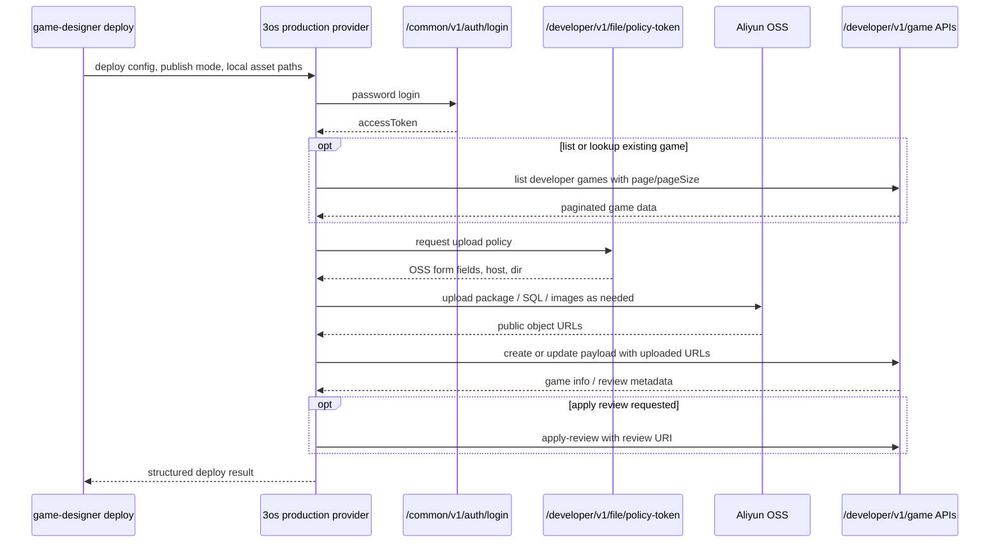
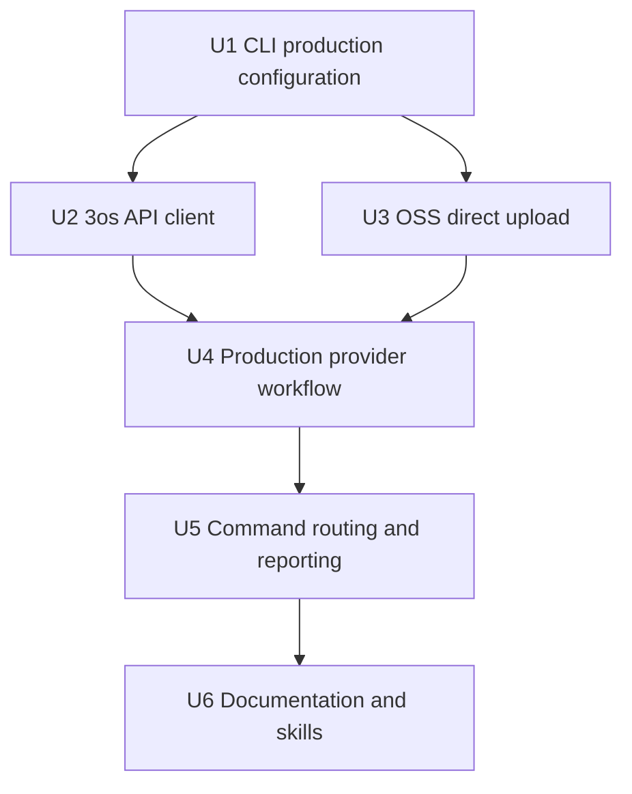

# feat: Replace Mocked Deploy CLI with Production PaaS Publishing

## Summary

Upgrade the Go deploy CLI from its current fake-provider lifecycle into a production publishing workflow for the 3os PaaS. The plan keeps the existing Cobra command, preflight, provider, and structured-reporting patterns, then adds authenticated API calls, Aliyun OSS direct uploads, developer game listing, create/update/version payload construction, review submission, and agent-readable documentation.

---

## Problem Frame

The existing CLI was intentionally built around a fake provider so agents could verify the deploy shape without touching production. The new requirement is to make game publishing real: login for an access token, upload the game package and SQL assets to OSS, call the developer game APIs, and submit the review flow described in `docs/requirements/cli-improve/readme.md`.

---

## Requirements

- R1. Authenticate against the production common auth API using password login and use the returned `accessToken` for developer API calls.
- R2. Fetch a developer file policy token and upload required local assets, including the game program package and optional SQL file, through Aliyun OSS direct upload.
- R3. Support creating a new game with an initial version using the production `create-with-version` API.
- R4. Support updating existing game base information through the production game update API.
- R5. Support publishing a new game version through the production `update-with-version` API.
- R6. Support listing the authenticated developer's games through the production paginated game list API.
- R7. Support applying for review after create or update by calling the production review application API.
- R8. Preserve the CLI's agent-readable success/failure JSON output and explicit error codes.
- R9. Keep fake-provider behavior available for local tests and offline smoke checks.
- R10. Avoid hardcoding credentials, tokens, production hosts, or sample game IDs from the requirement document.
- R11. Document the production configuration, expected asset inputs, game-list lookup behavior, and recovery path for failed auth, upload, publish, list, or review submission.

---

## Scope Boundaries

- In scope: production provider/client code inside the existing `cli/` module.
- In scope: CLI flags and environment-variable configuration needed for production publishing.
- In scope: local unit and integration-style tests using fake HTTP servers and mocked upload behavior.
- In scope: docs and skill updates that tell agents how to run the production provider safely.
- Out of scope: changing the 3os PaaS backend APIs or database behavior.
- Out of scope: validating game business content beyond CLI-side required fields and local file existence.
- Out of scope: implementing production health checks against deployed game runtime URLs unless the production API response exposes a stable URL to check.
- Out of scope: storing long-lived credentials in a local config file.

### Deferred to Follow-Up Work

- Token caching or refresh: useful after the first production provider is stable, but not needed for one CLI invocation.
- Rich manifest-driven publishing for multiple games: keep this iteration focused on the flags/config needed to reproduce the requirement examples.
- Post-review status polling: add after review state semantics are confirmed with the backend team.

---

## Context & Research

### Relevant Code and Patterns

- `cli/internal/commands/commands.go` owns the Cobra root, `preflight`, and `deploy` commands, and currently resolves all providers to a local fake adapter.
- `cli/internal/provider/provider.go` defines the current provider interface and result structs used by the deploy command.
- `cli/internal/provider/fake/fake.go` and `cli/internal/provider/fake/fake_test.go` provide a real package-level fake provider that should remain the offline test fixture.
- `cli/internal/reporting/reporting.go` centralizes structured JSON output and error codes used by agents.
- `cli/internal/preflight/preflight.go` validates local server paths and Go builds before deployment.
- `skills/gd-deploy-server/SKILL.md`, `skills/gd-prepare-deploy/SKILL.md`, and `cli/README.md` still describe the fake provider as the deploy path and need production-provider updates.
- Referenced sibling repo `paas-backend`: `internal/rest/common/auth.go` exposes `/common/v1/auth/login` and returns `resp.Response` envelopes.
- Referenced sibling repo `paas-backend`: `internal/rest/developer/file.go` exposes `/developer/v1/file/policy-token`.
- Referenced sibling repo `paas-backend`: `internal/rest/developer/game.go` exposes `/developer/v1/game`, `/developer/v1/game/create-with-version`, `/developer/v1/game/:uri`, `/developer/v1/game/update-with-version`, and `/developer/v1/game/apply-review`.
- Referenced sibling repo `paas-backend`: `domain/auth.go`, `domain/file.go`, `domain/game.go`, and `domain/game_version.go` define the request and response fields the CLI should mirror.
- Referenced sibling repo `paas-backend`: `domain/constant/pagination.go` defines the game list envelope fields: `page`, `pageSize`, `totalPages`, `totalCount`, and `data`.

### Institutional Learnings

- No `docs/solutions/` directory exists, so there are no local institutional learnings to apply.

### External References

- Alibaba Cloud OSS Go SDK V2 documentation says the SDK supports Go 1.18+ and imports as `github.com/aliyun/alibabacloud-oss-go-sdk-v2/oss`, which fits the CLI's Go 1.24 module.
- Alibaba Cloud's OSS PostObject V4 documentation describes policy, credential, date, security token, and signature form fields; these match the backend's `FilePolicyTokenResp`.

---

## Key Technical Decisions

- Add a production provider rather than replacing the provider abstraction: this preserves fake tests and keeps the current deploy command lifecycle recognizable.
- Introduce a small 3os API client package under `cli/internal/provider/threeos/`: API envelope parsing, auth, game payloads, and review submission are provider-specific and should not leak into Cobra command wiring. The CLI provider name should be `3os`; the Go package uses `threeos` because package identifiers cannot start with a digit.
- Use dependency-injected HTTP and upload clients: tests can prove request bodies, headers, error mapping, and upload paths without calling production or OSS.
- Prefer OSS POST form upload using the backend policy token as the first implementation path: the backend returns V4 POST form fields and upload host/dir, so the CLI can upload using that server-authorized contract without needing direct cloud AccessKey secrets.
- Keep credentials outside the command line where possible: support explicit flags for local use, but document environment variables as the safer agent/default path because shell histories can capture passwords.
- Treat create, update-info, and update-version as publish modes: the same provider can authenticate and upload assets, but the final developer API endpoint changes by mode.
- Add developer game list as both a query operation and an optional lookup helper: users should be able to list games directly, and update/version/review flows can resolve a game URI from authenticated developer-owned games when the implementation provides an unambiguous lookup.
- Submit review as an explicit option after successful game publish: review submission has separate state requirements, so the CLI should make it visible and report a clear failure if publish succeeded but review application failed.

---

## Open Questions

### Resolved During Planning

- Source of API contracts: use `docs/requirements/cli-improve/readme.md` plus the referenced `paas-backend` route/domain code as the planning source.
- Upload approach: use the policy-token direct-upload contract from the backend instead of adding cloud account credentials to the CLI.
- Test posture: keep production behavior covered by fake HTTP/OSS clients, not live production calls.

### Deferred to Implementation

- Exact response field to use as the review URI after create/update: confirm from actual `GameInfoResp.Reviews` payload during implementation, then choose the latest reviewing/debugging review URI or require `--review-uri` when ambiguous.
- Exact lookup key for resolving a game from the list endpoint: prefer explicit URI when supplied; if name lookup is added, require a single exact match and fail on zero or multiple matches.
- Exact production health/status mapping: if production create/update responses do not expose a deployed runtime URL or status, leave `HealthCheck` as a no-op/status summary for the 3os provider.
- OSS object naming details: choose deterministic names under the returned policy `dir` during implementation, preserving file extensions and avoiding collisions.
- Optional production base URL names: finalize flag/env names with repo conventions while keeping `https://api.3sdk.yu3.co` as the documented default.

---

## High-Level Technical Design

> *This illustrates the intended approach and is directional guidance for review, not implementation specification. The implementing agent should treat it as context, not code to reproduce.*

---

## Implementation Units

### U1. Add Production Deploy Configuration

**Goal:** Give the existing deploy command enough typed configuration to run against production without hardcoded credentials or sample IDs.

**Requirements:** R1, R3, R4, R5, R6, R7, R8, R9, R10

**Dependencies:** None

**Files:**
- Modify: `cli/internal/provider/provider.go`
- Modify: `cli/internal/commands/commands.go`
- Modify: `cli/internal/commands/deploy_integration_test.go`
- Test: `cli/internal/commands/deploy_integration_test.go`

**Approach:**
- Extend `DeployConfig` with production-neutral fields for API base URL, credentials, publish mode, game URI, optional game lookup fields, page/pageSize, review URI, metadata, local asset paths, version metadata, screen config, and build config.
- Keep existing `serverPath`, `appName`, `env`, `region`, and `provider` behavior so fake deploy tests remain meaningful.
- Parse configuration from flags with environment-variable fallbacks for sensitive fields such as identifier and password.
- Validate required combinations before calling the provider: create mode requires game metadata and package path, list mode requires only auth plus pagination defaults, update-version requires a game URI or unambiguous lookup plus version payload, apply-review requires either a discoverable review URI or an explicit one.
- Keep validation errors inside structured CLI output instead of raw Cobra usage errors once command execution begins.

**Patterns to follow:**
- `cli/internal/commands/commands.go` for existing flag parsing and structured deploy lifecycle.
- `cli/internal/reporting/reporting.go` for agent-readable success/failure envelopes.

**Test scenarios:**
- Happy path: fake provider still deploys with the existing minimal flags and emits `SUCCESS`.
- Happy path: production provider selection accepts required env-backed credentials without printing them.
- Happy path: list mode accepts omitted pagination and defaults to page 1/page size 10.
- Edge case: create mode without a package path fails before any provider call with a structured configuration error.
- Edge case: update-version mode without a game URI fails before any provider call with a structured configuration error.
- Error path: unsupported publish mode fails with a stable error code and explains the accepted modes.
- Integration: command-level test injects a provider resolver and proves parsed production fields are passed to the provider without invoking production services.

**Verification:**
- Existing fake deploy tests continue to pass.
- Production mode cannot start with missing credentials, missing asset paths, or invalid mode-specific identifiers.

---

### U2. Implement the 3os API Client

**Goal:** Encapsulate production HTTP calls, response-envelope parsing, auth headers, and endpoint-specific payload/response types.

**Requirements:** R1, R3, R4, R5, R6, R7, R8, R10

**Dependencies:** U1

**Files:**
- Create: `cli/internal/provider/threeos/client.go`
- Create: `cli/internal/provider/threeos/types.go`
- Create: `cli/internal/provider/threeos/client_test.go`
- Test: `cli/internal/provider/threeos/client_test.go`

**Approach:**
- Add a client with injectable `http.Client`, base URL, bearer token state, and JSON request helpers.
- Mirror only the backend fields the CLI needs from `paas-backend` domain types: auth login response, policy-token response, paginated game list response, game create/update request, game/version response metadata, and review application request.
- Parse the backend envelope shape where `code == 0` means success and non-zero codes are application failures even when HTTP status is 200.
- Attach `Authorization: Bearer <token>` only after successful login and never include token/password values in returned errors.
- Keep request and response structs local to the CLI to avoid importing the backend repo.

**Patterns to follow:**
- Referenced sibling repo `paas-backend`: `pkg/resp/resp.go` for the JSON response envelope.
- Referenced sibling repo `paas-backend`: `domain/auth.go` for login request/response fields.
- Referenced sibling repo `paas-backend`: `domain/game.go` and `domain/game_version.go` for game/version payload fields.
- Referenced sibling repo `paas-backend`: `domain/constant/pagination.go` for game list pagination fields.

**Test scenarios:**
- Happy path: login posts identifier, type `password`, and password data, then stores the returned access token.
- Happy path: authenticated create-with-version sends bearer auth and a payload containing game metadata, uploaded URLs, screen config, and build config.
- Happy path: authenticated game list calls `/developer/v1/game?page=1&pageSize=10` with bearer auth and parses `data`, `page`, `pageSize`, `totalPages`, and `totalCount`.
- Happy path: update-with-version sends the existing game URI plus a new version payload.
- Happy path: apply-review sends the selected review URI and treats an envelope success as completion.
- Edge case: backend returns HTTP 200 with non-zero envelope code; the client returns an application error preserving code/message but not secrets.
- Error path: malformed JSON response from any endpoint produces a typed client error that includes endpoint context.
- Error path: network timeout or connection failure returns a retryable-looking provider error without panicking.
- Integration: fake HTTP server test verifies the client calls endpoints under `/common/v1` and `/developer/v1` exactly as the requirement describes.

**Verification:**
- API client tests prove request paths, methods, auth headers, and envelope handling without live network access.

---

### U3. Add OSS Direct Upload Support

**Goal:** Upload local package, SQL, logo, or resource files through the backend-issued OSS policy token and return object URLs for game API payloads.

**Requirements:** R2, R3, R5, R7, R9

**Dependencies:** U1, U2

**Files:**
- Create: `cli/internal/provider/threeos/upload.go`
- Create: `cli/internal/provider/threeos/upload_test.go`
- Test: `cli/internal/provider/threeos/upload_test.go`

**Approach:**
- Model the backend `FilePolicyTokenResp` fields required for OSS POST V4 upload: policy, security token, signature version, credential, date, signature, host, and directory.
- Build multipart form uploads that include the returned policy fields and an object key under the returned directory.
- Preserve file extensions and derive stable object names from local filenames plus a collision-resistant suffix.
- Return the public URL produced by host plus object key, matching the URL fields expected by game create/update APIs.
- Inject an uploader interface so tests can validate form fields and failure behavior without calling Aliyun.
- Keep the Alibaba OSS Go SDK V2 as an implementation option for future advanced uploads, but prefer direct POST for this policy-token contract unless implementation discovers the backend expects SDK PutObject instead.

**Patterns to follow:**
- Referenced sibling repo `paas-backend`: `domain/file.go` for policy-token response fields.
- Referenced sibling repo `paas-backend`: `file/service.go` for the policy-token directory and POST V4 field semantics.
- Alibaba Cloud OSS PostObject V4 documentation for required form-field semantics.

**Test scenarios:**
- Happy path: package upload uses the policy-token host, returned dir prefix, security token, signature fields, and local file content.
- Happy path: SQL upload returns a URL ending in `.sql` and does not run when no SQL path is supplied.
- Edge case: empty file path is ignored for optional assets and rejected for required package upload.
- Edge case: local file missing or unreadable fails before requesting game create/update.
- Error path: policy-token endpoint succeeds but OSS upload fails; publish stops and reports upload failure with the local asset label.
- Error path: policy-token response missing host, dir, policy, or signature fails fast with a configuration/contract error.
- Integration: fake OSS server receives the multipart fields documented by the backend policy-token contract.

**Verification:**
- Upload tests prove object URL construction and multipart field coverage for required and optional assets.

---

### U4. Implement the Production Provider Workflow

**Goal:** Connect auth, upload, game publish, optional review application, status, and health behavior behind a real `provider.Provider` implementation.

**Requirements:** R1, R2, R3, R4, R5, R6, R7, R8, R9, R10

**Dependencies:** U1, U2, U3

**Files:**
- Create: `cli/internal/provider/threeos/provider.go`
- Create: `cli/internal/provider/threeos/provider_test.go`
- Modify: `cli/internal/provider/provider.go`
- Test: `cli/internal/provider/threeos/provider_test.go`

**Approach:**
- Add `ThreeOSProvider` implementing the existing provider interface, adapting richer production outputs into `DeployResult`, `StatusResult`, and `HealthResult`.
- Run the production publish lifecycle in this order: login, optional game list lookup, policy-token fetch, required uploads, publish API call, optional review application, result assembly.
- Run list-only mode as login followed by developer game list, returning the paginated games without requesting policy tokens or uploading assets.
- Route create, update-info, and update-version to distinct client methods while sharing auth/upload setup.
- Carry returned game list pagination, game URI, version URI, review URI, uploaded asset URLs, and review-application state in the deploy result details.
- Keep `Status` lightweight unless stable production status endpoints are added; it should summarize known publish/review state instead of inventing runtime health.
- Keep fake provider untouched as the offline provider.

**Patterns to follow:**
- `cli/internal/provider/fake/fake.go` for provider interface conformance and testability.
- Referenced sibling repo `paas-backend`: `game/service.go` for create-with-version and apply-review side effects, especially asynchronous image build and review deployment behavior.

**Test scenarios:**
- Happy path: create mode logs in, uploads package and SQL, creates the game/version, applies review when requested, and returns success details with game and upload URLs.
- Happy path: list mode logs in, fetches developer games with requested pagination, and returns a success result without upload or publish calls.
- Happy path: update-version mode logs in, uploads the new package, calls update-with-version, and leaves base game data unchanged unless supplied.
- Happy path: update-version mode can resolve a game URI from a single exact game-list match when that lookup mode is enabled.
- Happy path: update-info mode calls the game update endpoint without requiring a package upload when no version payload is requested.
- Edge case: game lookup returns zero or multiple matches; provider fails before upload/publish with a clear lookup error.
- Edge case: publish succeeds but apply-review fails; the result must make partial success visible and choose a stable non-success code for the command.
- Edge case: create/update response contains multiple review records; provider uses an implementation-confirmed selection rule or requires explicit review URI.
- Error path: auth failure stops before policy-token or upload calls.
- Error path: upload failure stops before game publish.
- Error path: game publish failure does not attempt review submission.
- Integration: provider test uses fake API and OSS servers to prove lifecycle ordering and no live network dependencies.

**Verification:**
- Provider tests demonstrate each publish mode and each major failure boundary with deterministic fake services.

---

### U5. Wire Provider Selection, Error Codes, and Structured Output

**Goal:** Make `game-designer deploy --provider 3os` usable by agents for list and publish workflows while preserving existing fake-provider behavior and reporting guarantees.

**Requirements:** R3, R4, R5, R6, R7, R8, R9, R10

**Dependencies:** U4

**Files:**
- Modify: `cli/internal/commands/commands.go`
- Modify: `cli/internal/reporting/reporting.go`
- Modify: `cli/internal/commands/deploy_integration_test.go`
- Create: `cli/internal/reporting/reporting_test.go`
- Test: `cli/internal/commands/deploy_integration_test.go`
- Test: `cli/internal/reporting/reporting_test.go`

**Approach:**
- Replace the hardcoded fake adapter resolver with explicit provider selection for `fake` and `3os`.
- Add reporting codes for configuration, auth, list/lookup, upload, publish, and review failures while keeping existing codes stable.
- Ensure stdout remains parseable JSON on command completion or failure, with human preflight lines either preserved before the final JSON line or moved into structured details.
- Include sanitized details for endpoint name, asset label, publish mode, list pagination, and game/review URI where useful; never include password, token, policy, signature, or security token values.
- Keep preflight behavior in front of deploy unless production publishing needs a documented bypass for non-Go game packages; if bypass is needed, make it explicit and tested.

**Patterns to follow:**
- Existing `deploy` command final JSON-line behavior in `cli/internal/commands/deploy_integration_test.go`.
- Existing reporting constants in `cli/internal/reporting/reporting.go`.

**Test scenarios:**
- Happy path: `--provider fake` still returns the current success JSON details.
- Happy path: `--provider 3os` list mode returns paginated developer game data from fake servers.
- Happy path: `--provider 3os` with fake servers returns a success JSON containing publish mode, game URI, uploaded URLs, and review state.
- Edge case: unsupported provider name fails with a provider/configuration error instead of silently using fake.
- Edge case: sensitive env-backed config values are absent from all JSON output and error messages.
- Error path: auth, list/lookup, upload, publish, and review errors map to distinct stable result codes.
- Integration: command-level production test verifies the final output remains one parseable `reporting.Result` JSON line.

**Verification:**
- Command tests cover fake and production provider selection, result-code mapping, and secret redaction.

---

### U6. Update Documentation and Agent Skills

**Goal:** Teach users and agents how to configure, list existing developer games, verify, and recover the production deploy flow.

**Requirements:** R8, R9, R10, R11

**Dependencies:** U5

**Files:**
- Modify: `cli/README.md`
- Modify: `docs/deployment/paas-provider.md`
- Modify: `docs/deployment/troubleshooting.md`
- Modify: `skills/gd-deploy-server/SKILL.md`
- Modify: `skills/gd-prepare-deploy/SKILL.md`
- Modify: `scripts/verify-plugin-package.sh`
- Test: `scripts/verify-plugin-package.sh`

**Approach:**
- Document production provider prerequisites, environment variables, required files, list mode, publish modes, and safe credential handling.
- Keep fake provider docs as the offline/smoke-test path, not the production path.
- Update `gd-deploy-server` so agents can choose fake for dry runs or `3os` for real publishing with explicit credentials and asset inputs.
- Update troubleshooting with concrete failure categories: login rejected, game list/lookup failed, policy token unavailable, OSS upload rejected, publish API rejected, review state invalid, and partial publish/review failure.
- Extend package verification to catch docs or skill files that still describe fake as the only provider.

**Patterns to follow:**
- Existing CLI README command layout and structured output examples.
- Existing skill success/failure-output sections in `skills/gd-deploy-server/SKILL.md`.

**Test scenarios:**
- Happy path: docs show a production deploy command that uses environment variables for credentials and local flags for non-secret asset paths.
- Happy path: docs show how to list developer games with default pagination before updating an existing game.
- Happy path: skill instructions include a dry-run/fake route and a real-production route.
- Edge case: docs explain how to publish without an optional SQL file.
- Error path: troubleshooting maps each new reporting code, including list/lookup failures, to an agent action.
- Integration: package verification fails if deploy docs still claim the MVP only has a fake provider.

**Verification:**
- Documentation and skill checks make the production provider discoverable without hiding the offline fake workflow.

---

## System-Wide Impact

- **Interaction graph:** The deploy command now spans local preflight, provider selection, production auth, developer game listing, policy-token upload authorization, OSS upload, game create/update APIs, and review submission.
- **Error propagation:** Backend envelope errors, OSS upload failures, local file errors, and provider validation errors must collapse into stable CLI result codes with sanitized details.
- **State lifecycle risks:** Publish can partially succeed before review submission fails; game lookup can also be ambiguous before publish begins. The CLI must report each state clearly so operators know whether to retry review, refine lookup, or create/update again.
- **API surface parity:** Fake provider remains available for tests, while `3os` becomes the production provider. The `deploy` command is the main public surface affected.
- **Integration coverage:** Unit tests alone are not enough; command-level tests with fake HTTP/OSS servers should prove the full lifecycle without real production calls.
- **Unchanged invariants:** Server template, SDK runtime behavior, OpenAPI game-server contract, and local verification scripts remain unchanged unless docs reference the new deploy provider.

---

## Risks & Dependencies

| Risk | Mitigation |
|------|------------|
| Production credentials leak through flags, logs, or JSON output | Prefer env vars in docs, redact sensitive fields in all errors/results, and add tests that assert secrets are absent. |
| Backend response envelopes return HTTP 200 for application failures | Parse `code`, `message`, and `data` consistently across auth, list, upload-policy, publish, and review APIs; treat non-zero code as failure. |
| Game list lookup selects the wrong game | Prefer explicit URI, require exact single-match lookup when lookup is enabled, and surface zero/multiple matches before upload or publish. |
| OSS POST V4 fields are incomplete or backend contract changes | Validate required policy-token fields before upload and keep upload logic isolated behind tests. |
| Publish succeeds but review application fails | Return a partial-success failure with game/review identifiers and recovery guidance. |
| Fake provider behavior regresses while adding production support | Keep fake provider package intact and run existing deploy tests against it. |
| CLI flags become too broad for repeated use | Keep this iteration explicit and document future manifest/config-file follow-up rather than adding a large config system now. |

---

## Documentation / Operational Notes

- `cli/README.md` should treat `--provider 3os` as the production path and `--provider fake` as dry-run/offline verification.
- `docs/deployment/paas-provider.md` should describe provider architecture, 3os production API dependencies, game list pagination, and safe config practices.
- `docs/deployment/troubleshooting.md` should include recovery steps for the new result codes, list/lookup failures, and partial publish/review states.
- Production examples must use placeholder identifiers and environment variables, not the concrete credential values shown in the requirement document.

---

## Sources & References

- **Origin document:** [docs/requirements/cli-improve/readme.md](../requirements/cli-improve/readme.md)
- Related CLI command code: `cli/internal/commands/commands.go`
- Related provider interface: `cli/internal/provider/provider.go`
- Related fake provider: `cli/internal/provider/fake/fake.go`
- Related reporting code: `cli/internal/reporting/reporting.go`
- Referenced sibling repo `paas-backend` auth contract: `domain/auth.go`
- Referenced sibling repo `paas-backend` file policy contract: `domain/file.go`
- Referenced sibling repo `paas-backend` game contracts: `domain/game.go`, `domain/game_version.go`
- Referenced sibling repo `paas-backend` pagination contract: `domain/constant/pagination.go`
- Referenced sibling repo `paas-backend` routes: `internal/rest/common/auth.go`, `internal/rest/developer/file.go`, `internal/rest/developer/game.go`
- Alibaba Cloud OSS Go SDK V2: [OSS SDK for Go 2.0](https://www.alibabacloud.com/help/en/oss/developer-reference/manual-for-go-sdk-v2/)
- Alibaba Cloud OSS POST V4: [A V4 signature in a PostObject request](https://www.alibabacloud.com/help/en/oss/developer-reference/signature-version-4-recommend)
