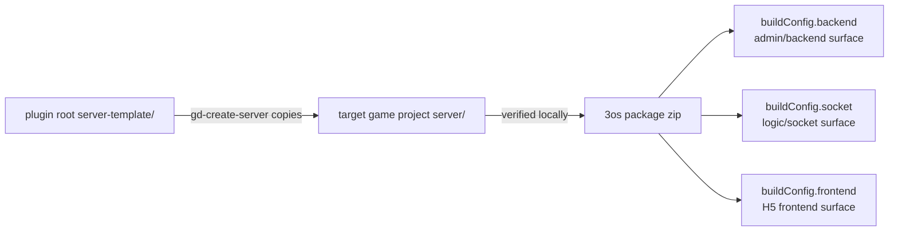

# refactor: Align Game Designer Skills with Project Server and 3os Deploy Shape

## Summary

Update the Game Designer agent skills and supporting docs so they match the intended user workflow: `gd-create-server` copies the bundled Go template into the target game's root `server/` directory, and the deploy skill is renamed away from server-only language while describing 3os publishing as a three-surface package deploy covering backend, socket, and frontend entries.

---

## Problem Frame

The current skills still describe a plugin-internal `server-template/` path as the created server path, which is useful for this repository but wrong for a consuming game project. The deploy skill name and body also still read like they deploy only a game server, even though the 3os payload expects `buildConfig.backend`, `buildConfig.socket`, and `buildConfig.frontend` entries where backend and socket may be the same binary launched with different commands or ports.

---

## Requirements

- R1. `gd-create-server` must instruct agents to copy the plugin's `server-template/` into the current target project root as `server/`.
- R2. Server creation verification must run against the target project's `server/` directory, not a target-project `server-template/` directory.
- R3. Existing references to plugin-bundled assets must distinguish source template path (`server-template/`) from consuming-project output path (`server/`).
- R4. Rename `gd-deploy-server` to a deployment skill name that does not imply server-only publishing.
- R5. The renamed deploy skill must describe production 3os deployment as publishing backend, socket, and frontend surfaces through `buildConfig`.
- R6. The deploy skill must explain that backend and socket can be one service artifact with different startup commands, ports, or modes.
- R7. Build-config examples must include the concrete `backend`, `frontend`, and `socket` shape from the user's 3os payload.
- R8. Supporting prepare/debug/docs/validation surfaces must stay consistent with the new `server/` output path, the renamed deploy skill, and the three-surface deploy model.
- R9. The plan must preserve the repository's own bundled `server-template/` directory as a plugin asset and avoid changing the Go server API or production CLI provider behavior unless verification reveals a doc/skill contract mismatch.

---

## Scope Boundaries

- In scope: root skill files, skill directory/frontmatter rename, integration docs, CLI README examples, package verification, and local verification guidance that describe the agent-facing workflow.
- In scope: CLI help text or examples only where wording currently implies server-only deployment or `server-template/` as the consuming-project output.
- In scope: validation that catches stale `server-template/` target-project wording and stale server-only 3os deploy wording.
- Out of scope: changing the bundled `server-template/` source directory in this repository.
- Out of scope: redesigning the 3os API client or provider internals; current code already models `backend`, `frontend`, and `socket` build config entries.
- Out of scope: adding a manifest-driven multi-service packaging system.

### Deferred to Follow-Up Work

- Add a project manifest for deriving `backend`, `socket`, and `frontend` buildConfig automatically from an H5 package layout.
- Add runtime port validation for backend/socket services after the 3os platform exposes a stable deployed runtime contract for both surfaces.

---

## Context & Research

### Relevant Code and Patterns

- `skills/gd-create-server/SKILL.md` currently says target projects may create `server-template/` and verifies commands under `server-template/`.
- `skills/gd-prepare-deploy/SKILL.md` and `skills/gd-debug-integration/SKILL.md` still use `../server-template` and `cd server-template` in consuming-project examples.
- `skills/gd-deploy-server/SKILL.md` already has `--backend-dir`, `--frontend-dir`, and `--socket-dir` flags, but the skill name, title, trigger, prerequisites, and success language still frame deployment as "the game server".
- `cli/internal/provider/provider.go` defines `BuildConfig` with `Backend`, `Frontend`, and `Socket` entries.
- `cli/internal/commands/commands.go` maps `--backend-dir`, `--backend-cmd`, `--frontend-dir`, `--frontend-cmd`, `--socket-dir`, and `--socket-cmd` into `provider.BuildConfig`.
- `cli/internal/provider/threeos/provider.go` serializes those entries as `buildConfig.backend`, `buildConfig.frontend`, and `buildConfig.socket`.
- `docs/requirements/cli-improve/readme.md` contains the user's 3os payload shape and shows `backend`, `frontend`, and `socket` workDir/cmd entries.
- `scripts/verify-plugin-package.sh` already validates skill naming, docs presence, bundled assets, and selected deploy-provider documentation references.

### Institutional Learnings

- No `docs/solutions/` directory exists, so there are no local institutional learnings to apply.
- `docs/plans/2026-05-16-003-refactor-superpowers-style-plugin-layout-plan.md` established that `server-template/` remains a repository-root bundled plugin asset.
- `docs/plans/2026-05-17-001-feat-production-cli-deploy-plan.md` established that the production 3os provider is the real deploy path while the fake provider remains for dry-run/offline verification.

### External References

- External research is not needed. The change is a local skill/docs contract correction grounded in the user's 3os payload and existing repository code.

---

## Key Technical Decisions

- Keep `server-template/` as the plugin source asset and use `server/` as the consuming-project destination. This preserves package structure while matching how a game project should look after `gd-create-server`.
- Update all skill examples by role, not by blind search-and-replace. Repository-local commands may still point at `server-template/`; consuming-project skill guidance should point at `server/`.
- Rename `gd-deploy-server` to `gd-deploy-game` and treat 3os deployment as package-level game publishing with three configured surfaces, not as a server-only deployment.
- Document backend/socket same-service cases through distinct `cmd` values, not through new CLI concepts. The current buildConfig model already supports one artifact launched in admin and logic modes.
- Strengthen validation around public docs and skills rather than adding code changes first, because the observed mismatch is primarily agent instruction drift.

---

## Open Questions

### Resolved During Planning

- Destination directory for `gd-create-server`: use `server/` at the current target project root.
- Deploy skill name: use `gd-deploy-game` because the skill publishes the whole game package, not only the server surface.
- 3os build surfaces: include `backend`, `socket`, and `frontend`.
- Backend/socket relationship: may be the same service artifact with different startup command, type, mode, or port.
- CLI implementation scope: no provider rewrite is needed for this plan because existing types and flag parsing already include the three buildConfig entries.

### Deferred to Implementation

- Exact copy command portability: implementation should choose host-appropriate copy tooling in the skill wording without hardcoding one shell-only path where the host has a better file-copy primitive.
- Whether CLI help text should call `--server-path` a legacy/local-preflight path or become `--server-dir`: decide after checking compatibility impact on existing tests and docs.
- Whether deploy skill examples should show explicit port flags in commands: include only if the generated server template or target package exposes stable port options.

---

## High-Level Technical Design

> *This illustrates the intended approach and is directional guidance for review, not implementation specification. The implementing agent should treat it as context, not code to reproduce.*

---

## Implementation Units

### U1. Correct `gd-create-server` Destination Semantics

**Goal:** Make server creation instructions copy the bundled template into the consuming project as `server/`.

**Requirements:** R1, R2, R3, R8

**Dependencies:** None

**Files:**
- Modify: `skills/gd-create-server/SKILL.md`
- Modify: `README.md`
- Modify: `docs/integration/agent-golden-path.md`
- Modify: `docs/integration/local-verification.md`
- Test: `scripts/verify-plugin-package.sh`

**Approach:**
- Rewrite `gd-create-server` so its source path is the plugin root `server-template/` and its destination path is the current target project's `server/`.
- Change build/run/endpoint checks in consuming-project instructions to operate from `server/`.
- Update success output to report `Server path: server/`.
- Preserve plugin-package docs that describe `server-template/` as a bundled asset of this repository.

**Patterns to follow:**
- Existing skill structure in `skills/gd-create-server/SKILL.md`: prerequisites, read/write scope, checks, success output, failure output.
- Existing package-layout distinction in `docs/integration/plugin-installation.md`.

**Test scenarios:**
- Happy path: package validation accepts `gd-create-server` wording where source is `server-template/` and destination is `server/`.
- Edge case: docs can still mention repository-root `server-template/` when describing bundled plugin assets.
- Error path: validation fails if `gd-create-server` success output or write scope says the target project creates `server-template/`.
- Integration: agent golden path describes create, prepare, and deploy using the same target server path.

**Verification:**
- A code agent following `gd-create-server` in a separate H5 project would create or use `server/`, not `server-template/`.

---

### U2. Align Prepare, Debug, and Local Verification Guidance

**Goal:** Keep downstream skills from sending agents back to the old target-project path after server creation is corrected.

**Requirements:** R2, R3, R7, R8

**Dependencies:** U1

**Files:**
- Modify: `skills/gd-prepare-deploy/SKILL.md`
- Modify: `skills/gd-debug-integration/SKILL.md`
- Modify: `skills/gd-connect-sdk/SKILL.md`
- Modify: `scripts/verify-local.sh`
- Modify: `docs/integration/local-verification.md`
- Modify: `docs/deployment/troubleshooting.md`
- Test: `scripts/verify-plugin-package.sh`

**Approach:**
- Update consuming-project examples to run build/test/preflight against `server/`.
- Keep repository-local verification scripts clear about whether they validate this plugin repository's bundled `server-template/` or an installed user's generated `server/`.
- Refresh troubleshooting examples so "missing go.mod" and build failures point to the generated project server directory.
- Avoid changing SDK runtime behavior; this unit is about path language and local checks.

**Patterns to follow:**
- `skills/gd-prepare-deploy/SKILL.md` and `skills/gd-debug-integration/SKILL.md` already have explicit checklists and failure recovery sections.
- `scripts/verify-local.sh` is the current repository smoke-test pattern and should remain usable for this repo.

**Test scenarios:**
- Happy path: prepare-deploy skill references the generated `server/` path for consuming projects.
- Happy path: debug skill diagnostics mention both SDK and generated server checks without stale target-project `server-template/`.
- Edge case: repository verification docs still explain that this plugin repository keeps its source template under `server-template/`.
- Error path: validation catches public docs that tell users to run `cd server-template` inside their target game project.

**Verification:**
- The create -> prepare -> debug path uses one coherent generated server location.

---

### U3. Rename and Reframe the Deploy Skill Around 3os Three-Surface Deployment

**Goal:** Rename the deploy skill to `gd-deploy-game` and make its instructions reflect 3os reality: backend, socket, and frontend are published together through `buildConfig`, with backend/socket allowed to share one service artifact under different commands.

**Requirements:** R4, R5, R6, R7, R8, R9

**Dependencies:** U1

**Files:**
- Move: `skills/gd-deploy-server/SKILL.md` to `skills/gd-deploy-game/SKILL.md`
- Modify: `skills/gd-deploy-game/SKILL.md`
- Modify: `skills/gd-prepare-deploy/SKILL.md`
- Modify: `skills/gd-debug-integration/SKILL.md`
- Modify: `.codex-plugin/plugin.json`
- Modify: `.claude-plugin/plugin.json`
- Modify: `cli/README.md`
- Modify: `docs/deployment/paas-provider.md`
- Modify: `docs/deployment/troubleshooting.md`
- Modify: `docs/integration/agent-golden-path.md`
- Modify: `README.md`
- Test: `scripts/verify-plugin-package.sh`

**Approach:**
- Move the skill directory and update frontmatter `name:` plus the H1 heading to `gd-deploy-game`.
- Update all cross-skill references and public docs so `gd-deploy-game` is the canonical deploy invocation.
- Treat `gd-deploy-server` as a stale public name after this refactor; do not keep an alias unless a host-level alias mechanism is added later.
- Rewrite the production deploy section to call out three surfaces: `backend` for admin/backend, `socket` for game logic or realtime/socket service, and `frontend` for the H5 game client.
- Include the user's concrete example shape in prose or JSON:
  - `backend.workDir`: `lucky77pro_1.0.7_20250625/admin`
  - `backend.cmd`: `./server_lucky77pro -type admin`
  - `frontend.workDir`: `lucky77pro_1.0.7_20250625/h5/20250624143413`
  - `frontend.cmd`: empty string for static frontend
  - `socket.workDir`: `lucky77pro_1.0.7_20250625/logic`
  - `socket.cmd`: `./server_lucky77pro -type logic`
- Mirror the same shape in CLI flag examples with `--backend-dir`, `--backend-cmd`, `--frontend-dir`, `--frontend-cmd`, `--socket-dir`, and `--socket-cmd`.
- Explain that backend and socket may point to the same binary or package content while using different commands, modes, or ports.
- Keep fake provider examples as dry-run/offline checks, not production 3os examples.

**Patterns to follow:**
- Existing 3os payload examples in `docs/requirements/cli-improve/readme.md`.
- Existing skill rename validation from `docs/plans/2026-05-16-005-refactor-prefix-skill-names-plan.md`.
- Current flag mapping in `cli/internal/commands/commands.go`.
- Current threeos buildConfig serialization in `cli/internal/provider/threeos/provider.go`.

**Test scenarios:**
- Happy path: package validation discovers `skills/gd-deploy-game/SKILL.md` with matching frontmatter and heading.
- Happy path: public docs and skill handoffs use `gd-deploy-game` as the deploy step.
- Happy path: deploy skill production example includes all three buildConfig entries.
- Happy path: CLI README shows frontend with an allowed empty command.
- Happy path: docs explain same-service backend/socket deployment through different commands.
- Edge case: docs avoid implying that frontend deploy requires a startup command.
- Error path: validation fails if `gd-deploy-server` remains as a public skill directory, frontmatter name, or active invocation target.
- Error path: troubleshooting distinguishes buildConfig mistakes from auth/upload/publish failures.
- Integration: package validation fails if production deploy docs describe 3os as server-only or omit either `frontend` or `socket`.

**Verification:**
- An agent sees `gd-deploy-game` as the deploy step and can map the user's 3os `buildConfig` JSON directly to CLI flags and deployment guidance.

---

### U4. Add Validation for Skill Contract Drift

**Goal:** Prevent future edits from reintroducing the wrong target path or server-only deploy model.

**Requirements:** R1, R3, R4, R5, R7, R8

**Dependencies:** U1, U2, U3

**Files:**
- Modify: `scripts/verify-plugin-package.sh`
- Test: `scripts/verify-plugin-package.sh`

**Approach:**
- Add checks that `skills/gd-create-server/SKILL.md` names `server/` as the target server path and keeps `server-template/` only as the plugin source asset.
- Add checks that public deploy docs and `skills/gd-deploy-game/SKILL.md` include `backend`, `frontend`, and `socket` buildConfig references.
- Add checks that `gd-deploy-server` no longer appears as an active skill directory, frontmatter name, or public invocation target.
- Add checks for the representative same-service/different-command wording so backend/socket semantics remain visible.
- Keep checks scoped to public skills/docs to avoid blocking legitimate repository-internal references to `server-template/`.

**Patterns to follow:**
- Existing Python snippets inside `scripts/verify-plugin-package.sh` for validating documentation references and stale naming.
- Existing validation style that reports clear PASS/FAIL labels.

**Test scenarios:**
- Happy path: validation passes when create skill source/destination wording is correct and deploy docs include all three build surfaces.
- Edge case: validation allows `server-template/` in plugin installation docs that describe bundled assets.
- Error path: validation fails if `gd-create-server` says `Server path: server-template/`.
- Error path: validation fails if `gd-deploy-game` omits `frontend` or `socket` from production guidance.
- Error path: validation fails if docs continue advertising `gd-deploy-server`.
- Error path: validation fails if docs revert to server-only 3os language.

**Verification:**
- Running package validation proves the agent-facing instructions match the new path and deploy contract.

---

## System-Wide Impact

- **Interaction graph:** The golden path becomes `gd-setup-cli` -> `gd-create-server` -> `gd-connect-sdk` -> `gd-prepare-deploy` -> `gd-deploy-game`, and the generated project server path changes from the documented `server-template/` target to `server/`.
- **Error propagation:** No runtime error paths change, but skill failure guidance should point users at the generated `server/` path and 3os buildConfig mistakes.
- **State lifecycle risks:** Deployment guidance must make partial 3os packaging state clear: frontend static files, backend service, and socket/logic service can each be configured differently inside the same package.
- **API surface parity:** CLI flags and provider structs already expose the three buildConfig surfaces; docs and skills should match that public surface.
- **Integration coverage:** Package validation is the main regression guard because this is an agent-instruction contract, not a new runtime feature.
- **Unchanged invariants:** The bundled `server-template/` asset, Go server API, SDK API, and 3os provider serialization should remain unchanged unless implementation discovers a direct inconsistency with the documented contract.

---

## Risks & Dependencies

| Risk | Mitigation |
|------|------------|
| Blind replacement breaks repository-local verification that intentionally uses `server-template/` | Separate "plugin source asset" wording from "target project output" wording and scope validation to public skills/docs. |
| Agents confuse backend/socket/frontend with separate repositories | Describe them as 3os package surfaces configured through `workDir` and `cmd`, not necessarily separate codebases. |
| Users or docs keep invoking the old `gd-deploy-server` name | Rename directory/frontmatter/docs together and add validation that treats the old name as stale public surface. |
| Backend/socket same-service behavior remains implicit | Include concrete same-binary examples using different `-type` commands and mention different ports/modes where applicable. |
| Existing users rely on `server-template/` in generated projects | Treat `server/` as the canonical path going forward and keep troubleshooting clear for projects created by older instructions. |
| Validation becomes too brittle around prose | Check for contract-bearing terms and examples, not exact paragraphs. |

---

## Documentation / Operational Notes

- Skill docs should use `server/` when talking about the user's target game project.
- Plugin packaging docs should keep `server-template/` when talking about bundled repository assets.
- Production 3os examples should prefer placeholder credentials and concrete buildConfig examples, never real tokens or passwords from requirement samples.
- Deploy docs should describe `frontend.cmd` as optional/empty for static H5 output.
- `gd-deploy-server` should not remain as an advertised invocation name after this refactor.

---

## Sources & References

- User request on 2026-05-17 in this session.
- Related skill: `skills/gd-create-server/SKILL.md`
- Related skill: `skills/gd-prepare-deploy/SKILL.md`
- Related current skill: `skills/gd-deploy-server/SKILL.md`
- Planned renamed skill: `skills/gd-deploy-game/SKILL.md`
- Related CLI config: `cli/internal/provider/provider.go`
- Related CLI flag mapping: `cli/internal/commands/commands.go`
- Related 3os serialization: `cli/internal/provider/threeos/provider.go`
- Related requirement sample: `docs/requirements/cli-improve/readme.md`
- Related prior plan: `docs/plans/2026-05-17-001-feat-production-cli-deploy-plan.md`
