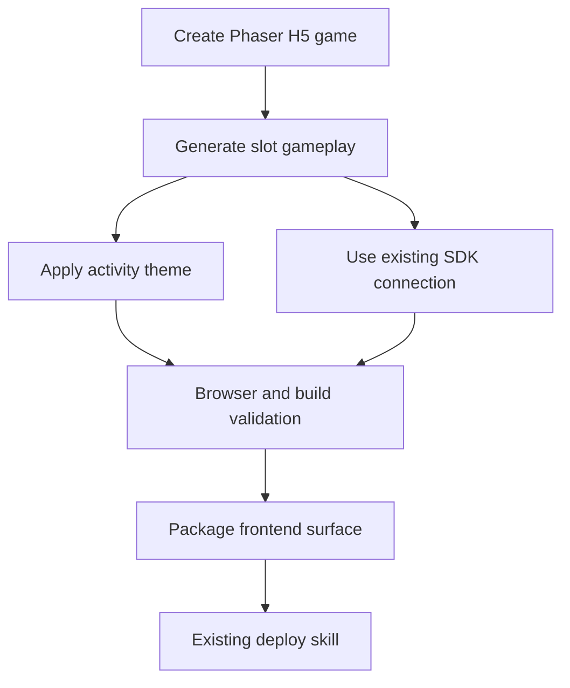
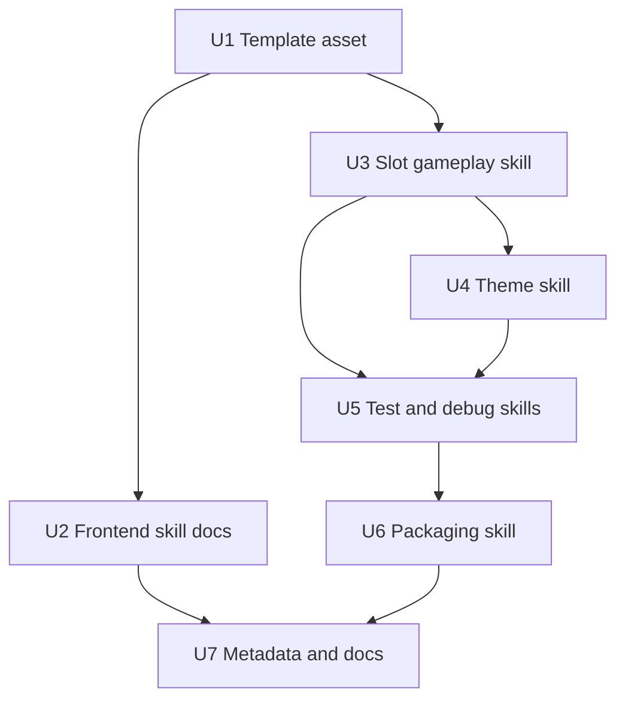

# feat: Add Phaser H5 frontend skills

## Summary

Add the first Game Designer frontend-development capability by introducing Phaser.js-based H5 game skills, a bundled playable slot template, browser validation guidance, and frontend packaging support that feeds the existing three-surface deployment model. The plan keeps the existing backend, SDK, and deploy skills intact while giving agents a clear path from "create a game frontend" to "package the static H5 client for deployment."

---

## Problem Frame

The plugin currently helps agents scaffold a Go backend, connect the TypeScript SDK, verify the server/SDK loop, and deploy a package. It does not yet help an agent create a real H5 browser game frontend, so the `frontend` surface in deployment remains something users must provide separately or hand-build from a thin SDK example.

---

## Requirements

- R1. Provide Phaser.js as the default H5 game engine for new frontend projects.
- R2. Add agent-facing skills for Phaser frontend scaffolding, slot gameplay generation, theming, browser validation, frontend packaging, and frontend-specific debugging.
- R3. Preserve the current responsibility boundary: backend creation, SDK wiring, preflight, deployment, and integration debugging remain in the existing skills unless their documentation needs to reference the new frontend path.
- R4. Ship a playable Phaser slot-machine template that exercises the current SDK golden path: session, slot config, balance, spin, history, and leaderboard.
- R5. Support fast activity-game customization through assets, theme tokens, copy, sounds, and mobile layout guidance without introducing a visual editor.
- R6. Add frontend verification that includes TypeScript/unit checks, production build checks, and browser-level H5 smoke coverage.
- R7. Add packaging guidance so the Phaser build output can become the existing deploy CLI's `frontend` surface.
- R8. Update plugin metadata and docs so agents can discover and sequence the new frontend skills.

---

## Scope Boundaries

- In scope: Phaser.js + TypeScript + Vite as the default frontend stack for new H5 games.
- In scope: one playable slot-machine frontend template aligned with the current slot backend and SDK.
- In scope: frontend skill instructions, bundled template assets, docs, and verification scripts/tests needed for agent use.
- In scope: browser/mobile validation guidance for the generated H5 frontend.
- Out of scope: Phaser Editor integration, visual H5 editor workflows, drag-and-drop game builders, and designer-facing no-code tooling.
- Out of scope: a multi-game template marketplace.
- Out of scope: adding non-slot gameplay templates in this first plan.
- Out of scope: changing server API behavior or expanding backend game capabilities beyond what the current SDK already exposes.

### Deferred to Follow-Up Work

- Additional Phaser gameplay templates such as clicker, match-card, endless runner, or quiz games: follow-up plans after the slot template proves the workflow.
- Reward, redemption, entitlement, payment, or monetization flows: separate backend/product scope.
- Advanced asset optimization pipelines such as texture atlases, sprite packing, or CDN upload: future hardening after the base packaging path lands.

---

## Context & Research

### Relevant Code and Patterns

- `skills/gd-create-server/SKILL.md`, `skills/gd-connect-sdk/SKILL.md`, `skills/gd-prepare-deploy/SKILL.md`, `skills/gd-deploy-game/SKILL.md`, and `skills/gd-debug-integration/SKILL.md` define the current skill format: prerequisites, when to apply, what the skill does, read/write scope, checks, success output, and failure output.
- `examples/h5-slot-machine/` is currently a TypeScript SDK integration example with Vitest coverage, not a browser-playable game. It is the closest existing example to extend or supersede for the Phaser path.
- `.codex-plugin/plugin.json` and `.claude-plugin/plugin.json` point to the shared `skills/` directory, so new skills become available by adding skill folders. The Codex metadata should also be refreshed so the display description and default prompt reflect frontend support.
- `docs/integration/agent-golden-path.md` is the canonical workflow doc and should become the place where the new frontend steps are sequenced with the existing backend/deploy path.
- `skills/gd-deploy-game/SKILL.md` already describes the production three-surface model and accepts `frontend` as a static H5 client surface, so frontend packaging should integrate with that model rather than inventing a new deployment path.

### Institutional Learnings

- No `docs/solutions/` learnings were present in this repo during planning.

### External References

- Phaser documentation says Phaser is included as a JavaScript library through npm, CDN, or downloaded assets, and is run in a browser page or bundle.
- Phaser documentation lists official project templates across major frameworks and bundlers, with TypeScript variants and a pure Vite TypeScript template.
- Phaser's create-game tutorial recommends `create-phaser-game` for official templates and suggests Web Bundler + Vite for first-time users.
- Vite documentation currently requires Node.js 20.19+ or 22.12+ and treats `index.html` as the project entry point for dev and build.

---

## Key Technical Decisions

- Use a bundled, deterministic Phaser template instead of invoking an interactive upstream scaffold at skill runtime: this keeps agent execution repeatable and avoids prompts, while still aligning the template structure with official Phaser/Vite conventions.
- Use Phaser + TypeScript + Vite for the frontend stack: it matches the user's explicit Phaser.js requirement, fits static H5 deployment, and gives fast local/browser iteration.
- Keep `gd-connect-sdk` focused on SDK integration: frontend gameplay skills may depend on the SDK and call its golden path, but the existing skill remains responsible for connecting the SDK into arbitrary H5 projects.
- Add dedicated frontend debugging rather than overloading `gd-debug-integration`: browser white screens, asset paths, canvas sizing, audio unlock, and build output issues require different diagnostics from server/contract/deploy failures.
- Treat browser validation as a first-class skill: a playable game can pass unit tests while still failing on mobile viewport, canvas sizing, asset loading, or runtime console errors.

---

## Open Questions

### Resolved During Planning

- Should frontend development use Phaser.js? Resolved: yes, Phaser.js is the default engine for the new H5 frontend capability.
- Should this plan include visual editing or a template marketplace? Resolved: no, keep the first frontend release focused on agent-generated Phaser H5 games and one slot template.
- Should the first gameplay template be slot-machine oriented? Resolved: yes, because the existing backend and SDK already expose slot config, balance, spin, history, and leaderboard.

### Deferred to Implementation

- Exact Phaser package version pin: choose during implementation after checking the current official/stable npm release and compatibility with the selected Vite/TypeScript versions.
- Exact template asset set: finalize during implementation based on small, redistributable placeholder art/audio that keeps the plugin lightweight.
- Exact browser automation tool surface: use the available Codex/Claude browser capability in the consuming environment, falling back to Playwright-based verification only if local project conventions already support it.

---

## Output Structure

    frontend-template-phaser/
      README.md
      package.json
      index.html
      vite.config.ts
      tsconfig.json
      src/
        main.ts
        game/
          scenes/
          ui/
          services/
        styles/
      public/
        assets/
      tests/
    skills/
      gd-create-h5-game/
        SKILL.md
      gd-create-slot-game/
        SKILL.md
      gd-theme-h5-game/
        SKILL.md
      gd-test-h5-game/
        SKILL.md
      gd-package-frontend/
        SKILL.md
      gd-debug-h5-game/
        SKILL.md

---

## High-Level Technical Design

> *This illustrates the intended approach and is directional guidance for review, not implementation specification. The implementing agent should treat it as context, not code to reproduce.*

The new frontend path creates a browser-playable Phaser client, maps current SDK slot data into game state and animations, then produces static build output that the existing deploy skill can publish as the `frontend` surface. Backend and deployment responsibilities remain owned by existing skills.

---

## Implementation Units

### U1. Add bundled Phaser H5 frontend template

**Goal:** Create a plugin-bundled Phaser + TypeScript + Vite template that agents can copy into consuming projects as the starting point for browser-playable H5 games.

**Requirements:** R1, R4, R6, R7

**Dependencies:** None

**Files:**
- Create: `frontend-template-phaser/README.md`
- Create: `frontend-template-phaser/package.json`
- Create: `frontend-template-phaser/index.html`
- Create: `frontend-template-phaser/vite.config.ts`
- Create: `frontend-template-phaser/tsconfig.json`
- Create: `frontend-template-phaser/src/main.ts`
- Create: `frontend-template-phaser/src/game/scenes/BootScene.ts`
- Create: `frontend-template-phaser/src/game/scenes/PreloadScene.ts`
- Create: `frontend-template-phaser/src/game/scenes/SlotScene.ts`
- Create: `frontend-template-phaser/src/game/services/gameDesignerClient.ts`
- Create: `frontend-template-phaser/src/game/ui/`
- Create: `frontend-template-phaser/src/styles/`
- Create: `frontend-template-phaser/public/assets/`
- Create: `frontend-template-phaser/tests/`

**Approach:**
- Use a plain Vite TypeScript project with Phaser as a runtime dependency and the Game Designer SDK wired through a small service boundary.
- Include scene boundaries for boot, preload, and slot gameplay so generated projects have obvious places for loading, layout, animation, and SDK state.
- Keep assets small and redistributable. Placeholder art/audio should demonstrate the asset pipeline without increasing plugin size unnecessarily.
- Configure the production build so output can be copied or zipped as static H5 files for the deploy CLI's `frontend` surface.

**Patterns to follow:**
- Existing template asset pattern in `server-template/`
- Existing SDK example structure in `examples/h5-slot-machine/`
- Existing package/test conventions in `sdk-js/package.json` and `examples/h5-slot-machine/package.json`

**Test scenarios:**
- Happy path: installing dependencies and building the template produces a static `dist` output with an `index.html` entry and bundled assets.
- Happy path: the template can create the Phaser game instance and register boot/preload/slot scenes without TypeScript errors.
- Integration: the SDK service boundary can be mocked in tests so slot gameplay logic can run without a live backend.
- Error path: when the SDK service reports an unavailable backend, the game enters a recoverable error state instead of leaving a blank canvas.

**Verification:**
- The template is copyable as a standalone frontend project.
- TypeScript and unit tests pass for the template.
- A production build produces static files suitable for `gd-deploy-game` frontend packaging.

---

### U2. Add `gd-create-h5-game` skill

**Goal:** Give agents a skill that creates or attaches a Phaser H5 frontend project from the bundled template.

**Requirements:** R1, R2, R3, R8

**Dependencies:** U1

**Files:**
- Create: `skills/gd-create-h5-game/SKILL.md`
- Test: `scripts/verify-plugin-package.sh`

**Approach:**
- Follow the existing skill document shape: prerequisites, when to apply, what the skill does, read/write scope, checks, success output, and failure output.
- Define clear write scope: target consuming project frontend directory only, not SDK/server/CLI source.
- Include detection rules for existing H5 projects so the skill can either create a new `frontend/` directory or attach to a user-selected frontend path without overwriting unrelated files.
- Make Node/Vite/Phaser prerequisites explicit, using current Vite Node version expectations.

**Patterns to follow:**
- `skills/gd-create-server/SKILL.md` for template-copy behavior
- `skills/gd-connect-sdk/SKILL.md` for SDK-aware frontend integration language

**Test scenarios:**
- Happy path: plugin package verification includes the new skill directory and its `SKILL.md`.
- Edge case: skill instructions describe how to stop when a target frontend directory already exists with unrelated files.
- Error path: skill failure output covers missing Node.js, missing template asset, dependency install failure, and build failure.

**Verification:**
- The skill is discoverable from the plugin skill directory.
- The skill gives an agent enough steps and checks to create a Phaser H5 frontend without reading long-form docs first.

---

### U3. Add `gd-create-slot-game` skill and playable slot behavior guidance

**Goal:** Let agents turn the Phaser H5 shell into a playable slot-machine frontend that consumes the existing Game Designer SDK golden path.

**Requirements:** R2, R3, R4, R6

**Dependencies:** U1, U2

**Files:**
- Create: `skills/gd-create-slot-game/SKILL.md`
- Modify: `frontend-template-phaser/src/game/scenes/SlotScene.ts`
- Create: `frontend-template-phaser/src/game/services/slotGameState.ts`
- Create: `frontend-template-phaser/tests/slotGameState.test.ts`
- Modify: `examples/h5-slot-machine/README.md`

**Approach:**
- Treat the server as authoritative for spin outcome and payout; the Phaser client animates and displays server-returned reels and balance rather than calculating results locally.
- Model slot state explicitly enough for tests: loading config, ready, spinning, result, insufficient balance, and backend error.
- Keep gameplay guidance aligned with existing SDK methods: session creation, slot config, balance, spin, history, and leaderboard.
- Preserve `gd-connect-sdk` as the general SDK integration skill. This skill should be specific to slot gameplay and should reference the SDK skill as a prerequisite when needed.

**Patterns to follow:**
- `sdk-js/examples/basic-slot-machine.ts`
- `examples/h5-slot-machine/src/game.ts`
- `skills/gd-connect-sdk/SKILL.md`

**Test scenarios:**
- Happy path: given a mocked session, slot config, balance, and winning spin result, the slot state transitions from ready to spinning to result and exposes updated balance and win data.
- Happy path: given a no-win spin result, the UI state shows a completed spin with no paylines and the reduced balance.
- Edge case: when balance is below wager, the client blocks the spin action and does not call the SDK spin method.
- Edge case: when the user changes wager outside the configured min/max range, the state clamps or rejects the value according to template rules.
- Error path: when the SDK throws a structured API error, the game shows a recoverable error state and keeps the player in the session.
- Integration: the Phaser scene subscribes to slot state updates and renders server-returned reels after spin completion.

**Verification:**
- A generated slot game demonstrates the complete slot loop through mocked tests and local browser play.
- No frontend code calculates payouts independently of the server response.

---

### U4. Add `gd-theme-h5-game` skill for activity customization

**Goal:** Help agents customize the Phaser game into a campaign-ready H5 activity through theme tokens, assets, copy, sounds, and mobile layout settings.

**Requirements:** R2, R5, R6

**Dependencies:** U1, U3

**Files:**
- Create: `skills/gd-theme-h5-game/SKILL.md`
- Create: `frontend-template-phaser/src/game/theme/defaultTheme.ts`
- Create: `frontend-template-phaser/src/game/theme/themeSchema.ts`
- Create: `frontend-template-phaser/tests/themeSchema.test.ts`
- Modify: `frontend-template-phaser/README.md`

**Approach:**
- Define a small theme surface for activity games: title/copy, colors, symbol labels/images, background, button states, sound toggles, and mobile-safe layout constants.
- Keep customization data-driven where possible so agents can swap a campaign theme without rewriting scene logic.
- Include asset validation guidance: missing asset fallback, size expectations, supported formats, and bundle-size cautions.
- Avoid visual editor assumptions. The skill should operate on project files and assets that the user or agent provides.

**Patterns to follow:**
- Existing skill success/failure output style in `skills/gd-prepare-deploy/SKILL.md`
- Phaser asset preload lifecycle from the bundled template

**Test scenarios:**
- Happy path: a complete theme configuration loads and maps to visible scene labels, colors, and symbol assets.
- Edge case: missing optional sound assets fall back to silent mode without breaking the game.
- Edge case: missing required symbol assets are reported before build or browser validation.
- Error path: invalid theme values produce actionable validation output for the agent.

**Verification:**
- The slot template can be re-themed without changing gameplay state logic.
- Generated activity copy and assets remain separate from SDK and backend integration code.

---

### U5. Add `gd-test-h5-game` and `gd-debug-h5-game` skills

**Goal:** Give agents a frontend-specific verification and troubleshooting loop for Phaser H5 games.

**Requirements:** R2, R3, R6

**Dependencies:** U1, U3, U4

**Files:**
- Create: `skills/gd-test-h5-game/SKILL.md`
- Create: `skills/gd-debug-h5-game/SKILL.md`
- Create: `frontend-template-phaser/tests/browser-smoke.md`
- Modify: `docs/integration/local-verification.md`

**Approach:**
- `gd-test-h5-game` should cover static checks, unit tests, production build, local preview, browser smoke testing, mobile viewport checks, console error checks, and asset-load checks.
- `gd-debug-h5-game` should categorize frontend failures separately from backend/deploy failures: white screen, Phaser boot failure, canvas sizing, asset 404, audio unlock, CORS/base URL/session issues, SDK API errors, build path issues, and deployed static asset issues.
- Browser verification should check that the canvas is nonblank, controls are clickable/tappable, spin animation or result rendering occurs, and visible text does not overlap at common mobile sizes.
- Keep backend troubleshooting handoff explicit: SDK/server/contract failures should route to `gd-debug-integration` when the root cause leaves the frontend surface.

**Patterns to follow:**
- `skills/gd-debug-integration/SKILL.md` for diagnostic category format
- Local verification wording in `docs/integration/local-verification.md`

**Test scenarios:**
- Happy path: test skill guidance proves a generated Phaser game builds, previews, renders a nonblank canvas, and completes a mocked spin.
- Edge case: mobile viewport verification catches overlapping controls or unusable tap targets.
- Error path: debug skill categorizes white screen, missing assets, SDK base URL failure, and deployed asset path failure with distinct next actions.
- Integration: frontend debug guidance routes server/contract failures to the existing integration debug skill instead of duplicating backend diagnostics.

**Verification:**
- Agents have a repeatable frontend verification loop before packaging.
- Frontend failures are diagnosable without conflating them with backend deployment failures.

---

### U6. Add `gd-package-frontend` skill and deployment handoff

**Goal:** Package the Phaser build output into the static frontend surface expected by the existing deploy CLI and `gd-deploy-game` skill.

**Requirements:** R2, R3, R7, R8

**Dependencies:** U1, U5

**Files:**
- Create: `skills/gd-package-frontend/SKILL.md`
- Modify: `skills/gd-deploy-game/SKILL.md`
- Modify: `docs/deployment/paas-provider.md`
- Modify: `docs/deployment/deployed-verification.md`

**Approach:**
- Define how a generated Phaser project's build output maps to the deploy CLI's `frontend` directory.
- Include checks for `index.html`, static assets, relative/absolute base path behavior, versioned package folder naming, and package size reporting.
- Update deployment guidance to show where `gd-package-frontend` fits before `gd-deploy-game`.
- Keep deployment execution in `gd-deploy-game`; this skill prepares frontend artifacts only.

**Patterns to follow:**
- Three-surface deployment explanation in `skills/gd-deploy-game/SKILL.md`
- Existing deployed verification docs in `docs/deployment/deployed-verification.md`

**Test scenarios:**
- Happy path: a Phaser production build is accepted as a frontend surface with `index.html` and assets present.
- Edge case: a build configured with an incompatible base path is flagged before deployment.
- Error path: missing build output, missing `index.html`, or empty assets produce actionable failure output.
- Integration: package guidance hands the resulting frontend directory to `gd-deploy-game` without changing backend or socket deployment behavior.

**Verification:**
- The frontend package can be passed to existing deploy commands as the `frontend` surface.
- Deployment docs and skill instructions agree on the frontend packaging step.

---

### U7. Update plugin metadata, golden path docs, and package verification

**Goal:** Make the new Phaser frontend skills discoverable and sequence them with the existing Game Designer workflow.

**Requirements:** R2, R3, R8

**Dependencies:** U2, U3, U4, U5, U6

**Files:**
- Modify: `.codex-plugin/plugin.json`
- Modify: `.claude-plugin/plugin.json`
- Modify: `.agents/plugins/marketplace.json`
- Modify: `README.md`
- Modify: `docs/integration/agent-golden-path.md`
- Modify: `docs/integration/plugin-installation.md`
- Modify: `scripts/verify-plugin-package.sh`

**Approach:**
- Refresh plugin descriptions from backend-only language to "H5 game frontend, backend, SDK, and deployment."
- Add the frontend skills to the documented golden path while keeping the backend-only path understandable for projects that already have a frontend.
- Extend package verification so new skill directories and the frontend template asset are checked during plugin validation.
- Update README capability tables and quick start so users can see both "create frontend" and "connect/deploy backend" flows.

**Patterns to follow:**
- Existing README golden path structure
- Existing plugin metadata shape in `.codex-plugin/plugin.json`
- Existing package verification conventions in `scripts/verify-plugin-package.sh`

**Test scenarios:**
- Happy path: plugin package verification succeeds when all new skill directories and template assets are present.
- Edge case: verification fails with a clear message if a required frontend skill or template file is missing.
- Integration: docs present a coherent end-to-end path from Phaser frontend creation through backend/SDK connection and deployment.

**Verification:**
- New skills are discoverable by Codex/Claude plugin loading.
- README and golden-path docs accurately describe the frontend-inclusive workflow.

---

## System-Wide Impact

- **Interaction graph:** The new frontend template depends on the existing SDK contract and feeds static output to the existing deployment surface. Existing backend and CLI behavior should remain unchanged.
- **Error propagation:** Frontend runtime errors should surface through the new H5 debug skill, while SDK/server/contract errors hand off to `gd-debug-integration`.
- **State lifecycle risks:** Slot spin state must prevent duplicate spins while a server-authoritative spin is in flight and must recover cleanly after SDK errors.
- **API surface parity:** Existing SDK methods remain the only frontend API boundary for server calls. No hand-written slot HTTP calls should be introduced in generated Phaser games.
- **Integration coverage:** Unit tests alone will not prove browser playability; browser smoke coverage must verify canvas rendering, mobile layout, controls, asset loading, and console health.
- **Unchanged invariants:** Existing `gd-create-server`, `gd-connect-sdk`, `gd-prepare-deploy`, and `gd-deploy-game` responsibilities remain stable. New skills extend the workflow before the existing deploy step.

---

## Risks & Dependencies

| Risk | Mitigation |
|------|------------|
| Phaser/Vite dependency drift breaks generated templates | Pin compatible versions during implementation and verify with build, unit, and browser smoke checks. |
| The template becomes too slot-specific to reuse for future games | Keep the base H5 template separate from slot gameplay guidance; put slot state and scenes behind clear boundaries. |
| Frontend skills duplicate existing SDK/backend responsibilities | Keep prerequisites and handoff language explicit; SDK connection remains in `gd-connect-sdk`, server diagnostics remain in `gd-debug-integration`. |
| Browser validation is skipped because it is harder than unit tests | Make `gd-test-h5-game` a named skill in the golden path and require visible canvas/control/asset checks before packaging. |
| Static asset paths fail after PaaS deployment | Add packaging checks for build base path, `index.html`, asset references, and deployed verification guidance. |

---

## Documentation / Operational Notes

- Update docs so users can choose between two entry points: "I already have an H5 frontend" and "create a new Phaser H5 frontend."
- Keep examples agent-readable and short. Long Phaser tutorials should be linked, not copied into skill docs.
- Document that the first frontend release is slot-machine oriented because the existing backend is slot-authoritative; future gameplay templates should be separate follow-up plans.
- Mention Node.js expectations in frontend skill prerequisites, since current Vite documentation requires Node.js 20.19+ or 22.12+.

---

## Sources & References

- Related code: `skills/gd-create-server/SKILL.md`
- Related code: `skills/gd-connect-sdk/SKILL.md`
- Related code: `skills/gd-deploy-game/SKILL.md`
- Related code: `skills/gd-debug-integration/SKILL.md`
- Related code: `examples/h5-slot-machine/`
- Related code: `.codex-plugin/plugin.json`
- Related code: `.claude-plugin/plugin.json`
- External docs: [Phaser project templates](https://docs.phaser.io/phaser/getting-started/project-templates)
- External docs: [Create Phaser Game app](https://phaser.io/tutorials/create-game-app)
- External docs: [Phaser setup and installation context](https://docs.phaser.io/phaser/getting-started/set-up-dev-environment)
- External docs: [Vite getting started](https://vite.dev/guide/)
